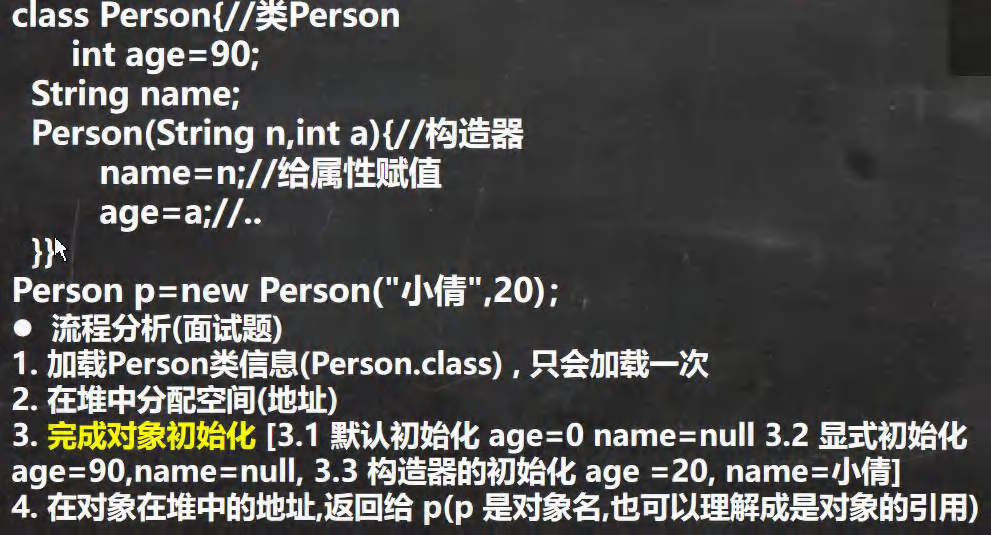
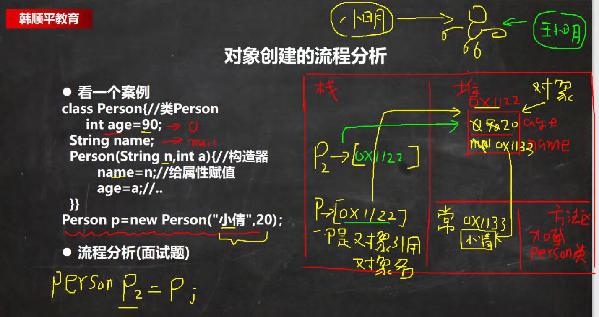
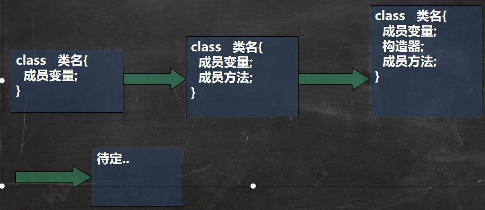

# 对象创建流程详解

> 1. [类与对象](./note/类与对象(OOP).md)
>
> 2. [成员方法](./note/成员方法.md)
>
> 3. [成员方法传参机制](./note/成员方法传参机制.md)
>
> 4. [Overload](./note/方法重载.md)
>
> 5. [构造器](./note/构造器.md)







# `This`关键字

## This 关键字

This的类型：哪个对象调用就是哪个对象的引用类型

值类型就是基本数据类型（int，double）而引用类型是指：**除了基本的变量类型之外的所有类型**（如通过class定义的类型）。

## 用法总结

```java
this.data; //访问属性

this.func(); //访问方法

this(); //调用本类中其他构造方法
```

## 用法详解

1. **this.data**

    1. 这种是在成员方法中使用

    2. 看看如果不加this的情况：

    3. ```java
        class MyDate{
            public int year;
            public int month;
            public int day;
         
            public void setDate(int year, int month,int day){
                year = year;//这里没有加this
                month = month;//这里没有加this
                day = day;//这里没有加this
            }
            public void PrintDate(){
                System.out.println(year+"年 "+month+"月 "+day+"日 ");
            }
        }
        public class TestDemo {
            public static void main(String[] args) {
                MyDate myDate = new MyDate();
                myDate.setDate(2000,9,25);
                myDate.PrintDate();
                MyDate myDate1 = new MyDate();
                myDate1.setDate(2002,7,14);
                myDate1.PrintDate();
            }
        }
        ```

    4. 很明显，我们想要的结果应该是2000/9/25与2002/7/14，但实际的输出却全是0

    5. 在我们加上this后：⬇️

    6. ```java
        class MyDate{
            public int year;
            public int month;
            public int day;
         
            public void setDate(int year, int month,int day){
               this.year = year;
               this.month = month;
               this.day = day;
            }
            public void PrintDate(){
                System.out.println(this.year+"年 "+this.month+"月 "+this.day+"日 ");
            }
        }
        public class TestDemo {
            public static void main(String[] args) {
                MyDate myDate = new MyDate();
                myDate.setDate(2000,9,25);
                myDate.PrintDate();
                MyDate myDate1 = new MyDate();
                myDate1.setDate(2002,7,14);
                myDate1.PrintDate();
            }
        }
        ```

    7. 那么这样，我们就实现了赋值的功能

2. **this.func()**

    1. 这种是指在普通成员方法中使用this调用另一个成员方法

    2. ```java
        class Student{
            public String name;
            public void doClass(){
                System.out.println(name+"上课");
                this.doHomeWork();
            }
            public void doHomeWork(){
                System.out.println(name+"正在写作业");
            }
        }
        public class TestDemo2 {
            public static void main(String[] args) {
                Student student = new Student();
                student.name = "小明";
                student.doClass();
            }
        }
        ```

    3. 只调用了一个doClass方法，就可以输出我们想要的

3. **this()**

    1. 这种指在构造方法中使用this调用本类其他的构造方法

    2. 注意如下几点：

    3. > 1.this只能在构造方法中调用其他构造方法
        >
        > 2.this要放在第一行
        >
        > 3.一个构造方法中只能调用一个构造方法

> ##### 具体可以看：
>
> [Java中关于This关键字的详解](https://blog.csdn.net/weixin_42386014/article/details/81138684)
