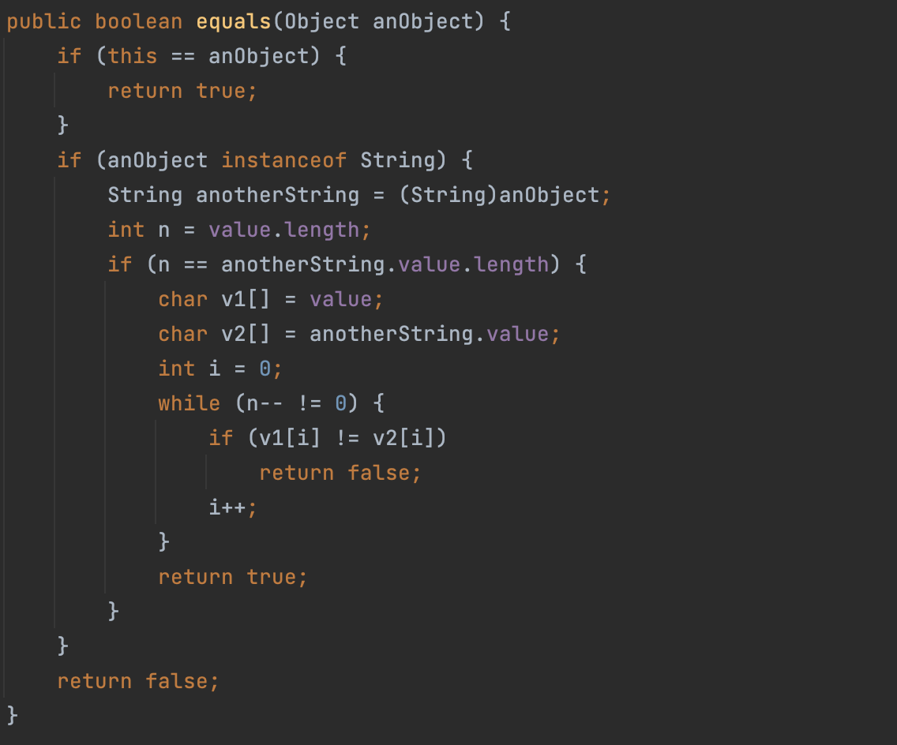

# Object类详解

## Object

```java
public class Object
```

Class `Object`是类`Object`结构的根。每个班都有`Object`作为超类。所有对象（包括数组）都实现了这个类的方法。

- 构造方法：

    ```java
    Object()
    ```
    
    ### 方法摘要

| Modifier and Type  | Method and Description|
|:-:|:--|
| `protected Object` | `clone()`创建并返回此对象的副本。                            |
| `boolean`          | `equals(Object obj)`指示一些其他对象是否等于此。             |
| `protected void`   | `finalize()`当垃圾收集确定不再有对该对象的引用时，垃圾收集器在对象上调用该对象。 |
| `类<?>`            | `getClass()`返回此 `Object`的运行时类。                      |
| `int`              | `hashCode()`返回对象的哈希码值。                             |
| `void`             | `notify()`唤醒正在等待对象监视器的单个线程。                 |
| `void`             | `notifyAll()`唤醒正在等待对象监视器的所有线程。              |
| `String`           | `toString()`返回对象的字符串表示形式。                       |
| `void`             | `wait()`导致当前线程等待，直到另一个线程调用该对象的 [`notify()`](../../java/lang/Object.html#notify--)方法或 [`notifyAll()`](../../java/lang/Object.html#notifyAll--)方法。 |
| `void`             | `wait(long timeout)`导致当前线程等待，直到另一个线程调用 [`notify()`](../../java/lang/Object.html#notify--)方法或该对象的 [`notifyAll()`](../../java/lang/Object.html#notifyAll--)方法，或者指定的时间已过。 |
| `void`             | `wait(long timeout, int nanos)`导致当前线程等待，直到另一个线程调用该对象的 [`notify()`](../../java/lang/Object.html#notify--)方法或 [`notifyAll()`](../../java/lang/Object.html#notifyAll--)方法，或者某些其他线程中断当前线程，或一定量的实时时间。 |

> **getClass**
>
> ```java
> public final 类<?> getClass()
> ```
>
> 返回此`Object`的运行时类。返回的`类`对象是被表示类的`static synchronized`方法锁定的对象。
>
> **实际结果的类型是`Class<? extends |X|>`其中`|X|`是静态类型上其表达的擦除`getClass`被调用。** 例如，在此代码片段中不需要转换：
>
> ```java
> Number n = 0;`
> `Class<? extends Number> c = n.getClass();
> ```
>
> - **结果**
>
>     表示 `类`对象的运行时类的Class对象。

## equals方法

- ==和equals的对比
    - ==是一个比较运算符
        - ==：既可以判断基本类型，又可以判断引用类型
        - ==：如果可以判断基本类型，判断的是值是否相等。比如`int a = 10; double b = 10.0;`
        - ==：如果判断引用类型，判断的是地址是否相等，也就是说判断是不是同一个对象（详见下面）
            - 再细说就是只要判断的不是基础数据类型而是数组或String，就会只判断地址相同
    - `equals`是Object类中的方法，只能判断引用类型
        - 默认判断的是地址是否相等，子类中往往重写该方法，用于判断内容是否相等，比如integer，String



> `instanceof` 是 Java 的保留关键字。它的作用是测试它左边的对象是否是它右边的类的实例，返回 boolean 的数据类型。

JDK源码 - String.equals

```java
//Jdk的源码 String类的 equals方法
        //把Object的equals方法重写了,变成了比较两个字符串值是否相同
        public boolean equals(Object anObject) {
        if (this == anObject) {//如果是同一个对象
            return true;//返回true
        }
        if (anObject instanceof String) {//判断类型
            String anotherString = (String)anObject;//向下转型
            int n = value.length;
            if (n == anotherString.value.length) {//如果长度相同
                char v1[] = value;
                char v2[] = anotherString.value;
                int i = 0;
                while (n-- != 0) {//然后一个一个的比较字符
                    if (v1[i] != v2[i])
                        return false;
                    i++;
                }
                return true;//如果两个字符串的所有字符都相等，则返回true
            }
        }
        return false;//如果比较的不是字符串，则直接返回false
    }
```

JDK源码 - Object.equals

```java
        //即Object 的equals 方法默认就是比较对象地址是否相同
        //也就是判断两个对象是不是同一个对象.
	// Object类中的equals方法比较的是地址，注意==对于引用类型比较的是地址，对于基本数据类型比较的是值。
         public boolean equals(Object obj) {
            return (this == obj);
        }
```

JDK源码 - Integer.equals

```java
public boolean equals(Object obj) {
        if (obj instanceof Integer) {
            return value == ((Integer)obj).intValue();
        }
        return false;
    }// 不是判断地址，而是单纯的integar后的int值
```

```java
public class Equals01 {

    public static void main(String[] args) {
        A a = new A();
        A b = a;
        A c = b;
        System.out.println(a == c);//true
        System.out.println(b == c);//true
        B bObj = a;
        System.out.println(bObj == c);//true
        int num1 = 10;
        double num2 = 10.0;
        System.out.println(num1 == num2);//基本数据类型，判断值是否相等

        //equals 方法，源码怎么查看.
        //把光标放在equals方法，直接输入command+b
        //如果你使用不了. 自己配置. 即可使用.

        "hello".equals("abc");


        /*
        //从源码可以看到 Integer 也重写了Object的equals方法,
        //变成了判断两个值是否相同
        public boolean equals(Object obj) {
            if (obj instanceof Integer) {
                return value == ((Integer)obj).intValue();
            }
            return false;
        }
         */
        Integer integer1 = new Integer(1000);
        Integer integer2 = new Integer(1000);
        System.out.println(integer1 == integer2);//false
        System.out.println(integer1.equals(integer2));//true

        String str1 = new String("hspedu");
        String str2 = new String("hspedu");
        System.out.println(str1 == str2);//false
        System.out.println(str1.equals(str2));//true
```

## 判断两个对象内容是否相等

```java
package Object;

public class EqualEx {
    public static void main(String[] args) {
        Person11 person11 = new Person11("Harry", 18, 180, 70);
        Person11 person22 = new Person11("Harry", 18, 180, 70);
        System.out.println(person11.equals(person22));// 这样（不重写equals）return的是false，因为指向的地址不同
        // 重写equals后就return true
    }
}

class Person11{
    private String name;
    private int age;
    private int height;

    // 重写equals方法
    public boolean equals(Object obj){
        // 如果判断比较的两个对象是同一个对象，那就返回true
       if (this == obj){
           return true;
       } if (obj instanceof Person11){// 判断obj是不是Person11的实例
           // 向下转型，取得obj的属性
           Person11 person1 = (Person11) obj;
           return this.name.equals(person1.name) && this.age == person1.age && this.weight == person1.weight && this.height == person1.height;
        }
       return false;
       // 类型的判断
    }

    
    public String getName() {
        return name;
    }

    public void setName(String name) {
        this.name = name;
    }

    public int getAge() {
        return age;
    }

    public void setAge(int age) {
        this.age = age;
    }

    public int getHeight() {
        return height;
    }

    public void setHeight(int height) {
        this.height = height;
    }

    public int getWeight() {
        return weight;
    }

    public void setWeight(int weight) {
        this.weight = weight;
    }

    public Person11(String name, int age, int height, int weight) {
        this.name = name;
        this.age = age;
        this.height = height;
        this.weight = weight;
    }

    private int weight;
}
```

### hashCode

> ```
> public int hashCode()
> ```
>
> 返回对象的哈希码值。支持这种方法是为了散列表，如`HashMap`提供的那样。
>
> `hashCode`的总合同是：
>
> - 只要在执行Java应用程序时多次在同一个对象上调用该方法， `hashCode`方法必须始终返回相同的整数，前提是修改了对象中`equals`比较中的信息。 该整数不需要从一个应用程序的执行到相同应用程序的另一个执行保持一致。
> - 如果根据`equals(Object)`方法两个对象相等，则在两个对象中的每个对象上调用`hashCode`方法必须产生相同的整数结果。
> - 不要求如果两个对象根据`equals(java.lang.Object)`方法不相等，那么在两个对象中的每个对象上调用`hashCode`方法必须产生不同的整数结果。 但是，程序员应该意识到，为不等对象生成不同的整数结果可能会提高哈希表的性能。
>
> 尽可能多的合理实用，由类别`Object`定义的hashCode方法确实为不同对象返回不同的整数。 （这通常通过将对象的内部地址转换为整数来实现，但Java的编程语言不需要此实现技术。）

1) 提高具有哈希结构的容器的效率！
2) 两个引用，如果指向的是同一个对象，则哈希值肯定是一样的！
3)  两个引用，如果指向的是不同对象，则哈希值是不一样的
4) 哈希值主要根据地址， 不能完全将哈希值等价于地址

```java
package Object;

public class HashCode {
    public static void main(String[] args) {
        HCTest hcTest = new HCTest();
        HCTest hcTest1 = new HCTest();
        HCTest hcTest2 = hcTest1;
        System.out.println(hcTest1.hashCode());
        System.out.println(hcTest.hashCode());
        System.out.println(hcTest2.hashCode());
    }
}

class HCTest{

}
```

### toString

- 基本介绍

    - 默认返回：全类名+@+哈希值的十六进制

        - ```java
            public String toString() {
                // getClass().getName()
                // 类的全类名（包+类名字）
                // Integer.toHexString(hashCode()) 将最新的hashcode转化成十六进制的字符串
                    return getClass().getName() + "@" + Integer.toHexString(hashCode());
                }
            ```

        - Object.toString源码

    - 代码

    - ```java
        package Object;
        
        public class toString {
            public static void main(String[] args) {
                Monster monster = new Monster("wild one", "walk", 3000);
                System.out.println(monster.toString());
            }
        }
        
        class Monster{
            private String name;
            private String job;
            private double sal;
        
            public Monster(String name, String job, double sal) {
                this.name = name;
                this.job = job;
                this.sal = sal;
            }
        }
        ```

    - 返回值：`Object.Monster@1540e19d` 

- 重写toString

- ```java
    package Object;
    
    public class toString {
        public static void main(String[] args) {
            Monster monster = new Monster("wild one", "walk", 3000);
            System.out.println(monster.toString());// 16进制
            System.out.println(monster.hashCode());// 10进制
    
        }
    }
    
    class Monster{
        private String name;
        private String job;
        private double sal;
    
        public Monster(String name, String job, double sal) {
            this.name = name;
            this.job = job;
            this.sal = sal;
        }
    
        // 重写toString方法，输出对象的属性
        // 快捷键command+N直接改成toString
        @Override
        public String toString() {//默认是对象的属性值输出
            return "Monster{" +
                    "name='" + name + '\'' +
                    ", job='" + job + '\'' +
                    ", sal=" + sal +
                    '}';
        }
    }
    ```

    

- 当输出一个对象的时候，会默认调用toString方法

### finalize方法

> #### finalize
>
> ```java
> protected void finalize()
>                  throws Throwable
> ```
>
> 当垃圾收集确定不再有对该对象的引用时，垃圾收集器在对象上调用该对象。一个子类覆盖了处理系统资源或执行其他清理的`finalize`方法。
>
> `finalize`的一般合同是，如果Java¢虚拟机已经确定不再有任何方法可以被任何尚未死亡的线程访问的方法被调用，除非是由于最后确定的其他对象或类的准备工作所采取的行动。 `finalize`方法可以采取任何行动，包括使此对象再次可用于其他线程; 然而， `finalize`的通常目的是在对象不可撤销地丢弃之前执行清除动作。 例如，表示输入/输出连接的对象的finalize方法可能会在对象被永久丢弃之前执行显式I / O事务来中断连接。
>
> 所述`finalize`类的方法`Object`执行任何特殊操作; 它只是返回正常。 Object的`Object`可以覆盖此定义。
>
> Java编程语言不能保证哪个线程将为任何给定的对象调用`finalize`方法。 但是，确保调用finalize的线程在调用finalize时不会持有任何用户可见的同步锁。 如果finalize方法抛出未捕获的异常，则会忽略该异常，并终止该对象的定类。
>
> 在为对象调用`finalize`方法之后，在Java虚拟机再次确定不再有任何方式可以通过任何尚未被死亡的线程访问此对象的任何方法的情况下，将采取进一步的操作，包括可能的操作由准备完成的其他对象或类别，此时可以丢弃对象。
>
> `finalize`方法从不被任何给定对象的Java虚拟机调用多次。
>
> `finalize`方法抛出的任何异常都会导致该对象的终止被停止，否则被忽略。

1) 当对象被回收时，系统自动调用该对象的finalize 方法。子类可以重写该方法，做一些释放资源的操作【演示】
2) 什么时候被回收：当某个对象没有任何引用时，则jvm 就认为这个对象是一个垃圾对象，就会使用垃圾回收机制来销毁该对象，在销毁该对象前，会先调用finalize 方法。
3) 垃圾回收机制的调用，是由系统来决定(即有自己的GC 算法), 也可以通过System.gc() 主动触发垃圾回收机制，测试：Car [name]

```java 
package Object;

public class Finalize {
    public static void main(String[] args) {
        Car car = new Car("car");
        car = null; // 这时候car就变成垃圾了， 垃圾回收器自动回收（销毁）对象
        // 销毁对象的时候就会调用finalize方法
        // 那么我们就可以在finalize中写自己的业务逻辑代码
        System.gc(); // 强制叫出来gc
    }
}

class Car{
    private String name;

    public Car(String name) {
        this.name = name;
    }

    @Override
    protected void finalize() throws Throwable {
        System.out.println("Work done");
    }
}
```

test
