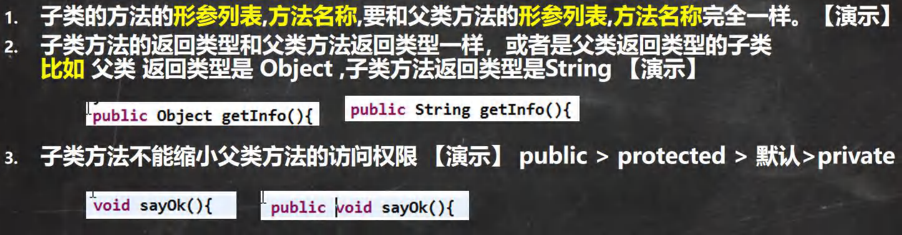
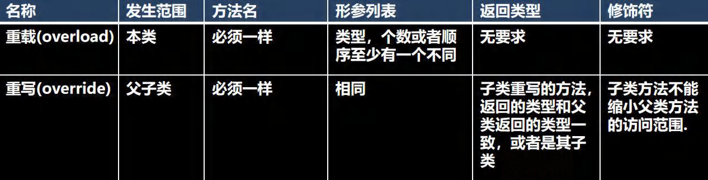

# Super

- 基本介绍：

    - `super`表示父类的引用，用于访问父类的**属性**，**方法**，和**构造器**

- 基本语法

    1. 访问父类的属性，但不能访问父类的private属性

     ```java
        super.属性名；
     ```

    2. 访问父类的方法，不能访问父类的private方法
    ```java
    super.方法名(形参列表)
    ```

    3. 访问父类的构造器
	```java
	super.(参数列表)；//这里只能放在构造器的第一句，只能出现一句

具体可以看这个[blog](https://blog.csdn.net/weixin_55782195/article/details/114403020)

# Override

***

方法重写

***

- 简单介绍：
    - 方法重写就是子类有一个方法和父类某个方法的名词，返回类型，参数都一样，那么我们就说子类的这个方法覆盖类父类的方法



