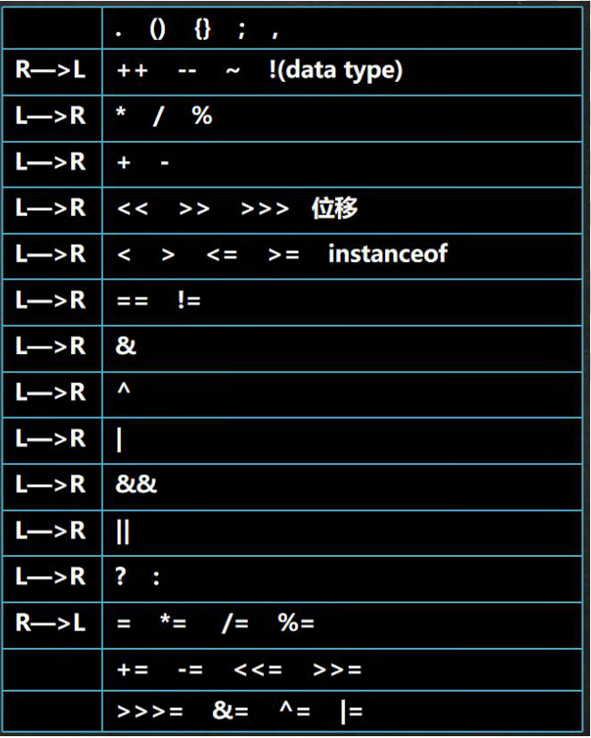
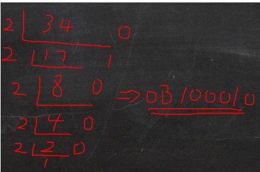
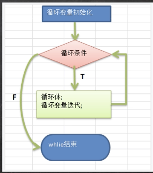
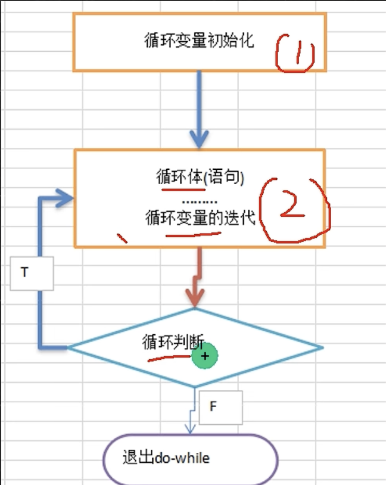

# **NOTE ONE**

***

# 主类结构

```java
public class hello {
    public static void main(String[] args) {
        String s1 = "hello"; //定义变量字符值
        String s2 = "Java";
        String s3 = "is sooooooo hard";

        System.out.println(s1);
        System.out.println(s2);
        System.out.println(s3);
    }
}
```

- 开始需定义public 类(class)

[!Note]class 不等同于Class (严格区分大小写)

- public class 定义初始类, 继续class可继续定义新类
```java
public static void main 
```
- 定义类: main 
- 括号后面的内容进行内容定义(args)
- double(用处不明)
- System.out.printIn()和print一样, system在terminal输出print字符串

```java
public class BMI{
    public static void main(String[] args) {
        double height = 180;
        int weight = 65;
        double exponent = weight/(height*height);
        System.out.println(
                "您的身高是: " + height
        );
        System.out.println(
                "您的体重是: " + weight
        );
        System.out.println("您的BMI指数为");
        if (exponent < 18.5) {
            System.out.println("您体重太轻了");
        }
        if (exponent >= 18.5 && exponent <29.9) {
            System.out.println("体重过重");
        }
        if (exponent >= 29.9){
            System.out.println("肥胖");
        }
    }
}
```


# 基本数据类型

#### 	整数数据类型:

int	64位 (***默认类型***)

声明: 

```java
int a = 15;
int b = 30;
int c = a-b;
System.out.printIn(c);
```

- byte	8位
-   声明: 和int一样

```java
byte a, b, c;
```

- short	16位
  - 声明: 和int相同

```java
short a = 90;
```
- long	32位
  - 声明:  结尾加L 或者l 其他和int一样

```java
long number;
long number = 30L;
```
- float 单精度浮点类型
  - 声明: 小数后面+ F or f

```java
float f1 = 2.2132132f;
```

- Double  双精度浮点类型:
  - 声明: 默认都是double数据类型, 小数后面+ D 或者d.
  - 但是没有特定要求

```java
double f2 = 2.2323423;
double f3 = 2.3242234d;
```

#### 字符类型:

- char 型:
  - 用于储存单个字符, 占用16位内存空间.
  - 用单引号表示, ‘s’ 

***注意! 双引号就是字符串了***

```java
char a = 'b';
```

可以用unicode 来表示, 所以上面的也可以用

```java
char a = 98;
```

#### 转义字符:

- \123 八进制
- \u0052 四位16进制
- \\' 单引号
- \\\ 反斜杠

- \t 垂直制表符
- \r 回车
- \n 换行
- \b back space
- \f 换页


#### 布尔类型:

```java
boolean b;
boolean b1, b2;
boolean b True;
```

- 逻辑类型, 简称布尔型.
  - Boolean只有 True 或者是 False, 且不可以和整数类型转换.

***一般是在流程判断中做为条件变量以及条件判断 来定义布尔类型.***


# 变量与常量

#### 声明变量 

```java
int age = 33;
double number3 = 2.3333d;
char word = 'w';
```

**系统内存 ⇢ program区 ⇢  Data 区**

写程序的时候在系统内存, 执行时进入内存中的program区, 数据暂存数据(Data)区.


#### 声明常量(一直不会改变的量, 也叫 final 常量)

- 声明要指定数据类型 + final关键字
- final 数据类型 常量类型 [= 值]
- 常量一般全拼用大写字母, 如:

```java
final float PI = 3.1415926f;
```

#### 变量的有效范围

- 变量定义出后都暂存在内存中, 等程序执行到某个点, 变量会随内存释放, 就失去有效范围.

- 因此, 分出了“_成员变量_” 和 “_局部变量_”.

- 在变量名前加上 **static** 就是静态变量, 可以跨类和整个应用程序进行应用(类似python的function “def” )


#### _Java 数据类型_ (背过)
 - 基本数据类型
   - 数值型 (int)
     - 整数类型, 存放整数 (byte[1], short [2], int [4], long[8])
     - 浮点(小数)类型 (float[4], double[8])
   - 字符型 (char[2]), 存放单个字符 _'a'_
   - 布尔型 (boolean[1]), 存放 true, false
 - 引用数据类型
   - 类 (class)
   - 接口 (interface)
   - 数组 ([])

> [!NOTE]
> (_[]_ 内的是字节)
> 小数和整数完全不同, 如果选择较大的, 精度大的小数, 就用double.
> 布尔类型为判断类型, 真假
> _引用数据类型, 在面向对象编程中_
> `string` 是一个类, 不是数据类型


#### 整数类型的使用
 - Java的整数类型就是用来存放整数数值的
 - 整数的类型: 

|类型|占用储存空间|范围|
|----|----|----|
|byte[字节]|1字节|-128~127|
|short[短整型]|2字节|$-2^{15}$ ~ $2^{15}-1$ </br> $-32768 ~ 32767$|
|int[整形]|4字节|$-2^{31}$ ~ $2^{31}-1$ </br> -2147483647 ~ 2147483647|
|long[长整型]8字节|$-2^{63}$ ~ $2^{63} -1 $|

> [!NOTE]
> 具体为社么涉及到二进制, 四种整数类型

**案例演示:**
```java
byte n1 = 10; //这样分配的是一个字节
// n1数值指向内存, n1 = 10, 占用一个字节大小
short n2 = 10; //这样分配的是两个字节
```
> [!NOTE]
> 虽然数值一样, 但是由于所指数据类型不一样,所以所占空间不同
> 以此类推, 和上章的表格是一模一样的


#### 整数类型的细节
1. Java各整数类型有固定的范围和字段成都, 不受具体OS[操作系统]的影响 以保证java程序的可移植性.
2. Java的整数型常量(具体型)默认为int型(不指示数据类型的话), 声明long型的话必须后面加 'l' 或 'L'
3. java程序中木哦人为int型, 除非不足以表示大数, 才使用long
4. `bit`: 计算机中的**最小储存单位**; `byte`: 计算机中**基本储存单元**, `1byte = 8 bit`

> [!Note]
> **尽量选择小的数据类型, 保小不保大**
> 如果能确认, 那就小, 但是不确认(如回文报), 那就保险用long

**实例演示**

```java
public class Int Detail {
  public static void main(String[] args){
    int n1 = 1; // 4个字节
    int n2 = 1L; // 变成long型, 编译报错, 原因是数据类型不同
    long n3 = 1L // 正确long
  }
}
```

> [!NOTE] byte 和 bit 怎么在计算机内存储?
一个字节为基本单位, 一个字节内包含8个bit. 

```java
byte n1 = 3
short n2 = 3
```

|byte|short|
|---|---|
|00000011|0000000000000011|
|一个字节|两个字节|

_↑一个 '0/1' 就是一个bit_

> 思考: long n3 = 5 在内存中怎么画出来

#### 浮点类型 (float)
 - **基本介绍:**
   - Java的浮点类型可以表示一个小数, 比如 123.4, 7.8, 0.12等等

|类型|占用内存空间|范围|
|---|---|---|
|单精度 float|4字节|-3.403E38 ~ 3.403E38|
|双精度 double|8字节|-1.798E308 ~ 1.798E308|

> [!NOTE]
> 1. 关于浮点数在机器中存放形式的简单说明, 浮点数 = 符号位+指数位+尾数位
> 2. 尾数可能丢失 造成精度损失 (小数都是近似值)


 - **案例演示:**
```java
double n1 = 88.9
```

#### 浮点型使用细节

 - **浮点型使用细节**
   - 与整数型类似, Java浮点类型也有固定的范围和字段长度, 不受OS的影响 [float4个字节, double 8个字节]
   - Java的浮点型常量 (具体值) 默认为`double`型, 声明 `float`型常量, 后面必须加 'f' 或者 'F'
   - **浮点型有两种表现形式**:
     - **十进制**: 5.12, 521.0f, 0.521
     - **科学计数法**: 5.12e2[5.12e*10的二次方], 5.12e-2[5.12e*10负二次方]
   - 通常情况下, 应该使用double型, 因为更精确
     - `double num9 = 2.1234567851;` 输出结果为原数
     - `float num10 = 2.1234567851F;` 输出结果为2.1234567, 保留了7位小数

**案例演示**
```java
float num1 = 1.1; //报错, 因为float为4字节, 而默认为double
float num2 = 1.1F; // 这是正确的
double num3 = 1.1; //这也是正确的
double  num4 = 1.1F; // 可以, 把4字节塞进8字节
//十进制
double num5 = .123; //等价0.123
//科学计数法
double num6 = 5.12e-2; //0.0512
```

**陷阱**
```java
double num11 = 2.7; //输出为2.7
double num12 = 8.1 / 3; // 输出为接近2.7的一个小数, 而不是2.7
```
> [!ATTENTION]
> 当我们对运算结果是小数的进行相等判断时, 要小心.
> **应该是以两个数的差值的绝对值, 在某个精度范围类判断**
> 如果是直接查询出的小数或直接赋值, 那可以判断相等

```java
if(num11 == num 12){
  System.out.printIn("equal")
};
//结果不输出
//正确写法: 可以通过Java的API来进行判断
if (Math.abs(num11 - num12) < 0.00001 ){
  System.out.printIn("equal")
};
// 差值非常小, 到所规定的规定精度, 就认为相等
```

#### 字符类型(char)

**字符类型可以表示单个字符, 字符类型为char, 占用内存两个字节, 多个字符用string**

```java
char c1 = 97; //字符类型可以直接存放一个数字, 97的对应就是a
char c2 = '\t'; // 两个合起来就是一个转义字符
char c3 = '啊啊啊'
char c4 = 'a'
```

字符类型可以直接存放, 根源是对应不同的数字.
也就是说, 如果char直接打数字, 就会输出对应97的字符

#### 字符类型使用细节
1. 字符常量是使用 `('')`, 必须使用单引号, 双引号就是字符串了
2. Java中还允许使用转义字符 `\` 来将其后面的字符转变为特殊字符型常量, 例如: `char c3 = '\n';`
3. Java中, 它的本质是一个整数, 输出时所对应的是unicode码所对应的数字

```java
public class CharDetail{
  public static void main(String[]args){
    char c1 = 97
    System.out.printIn(c1); //输出为a

    char c2 = 'a'
    System.out.printIn((int)c2); //输出为97
  }
}
```

4. 可以给 `char` 赋一个整数, 输出时就会按照对应的unicode字符输出
5. `char` 类型是可以进行运算的, 因为其本质是数字

```java 
system.out.printIn('a'+10) // 输出为107
```

#### 字符类型的本质

1. 字符型存储到计算机中, 需要将字符对应发码值找出, 
  - 比如a => 97 => 转成二进制(110 0001) => 进行存储
  - 读取: 二进制(110 0001) => 97 => a
2. 字符编码表
   1. ASCII: 一个字节表示, 一个128个字节
   2. Unicode: Unicode无论字母汉字都是两个字节
   3. UTF-8: 大小可变, 字母一个字节, 汉字3个字节
   4. GBK: 表示汉字, 范围广, 字母一个, 汉字2个
   5. Big5: 繁体中文

#### 布尔类型: Boolean

1. 布尔类型只允许取值true或false, 无null
2. 只占一个字节
3. 适用于逻辑运算, 一般用于程序流程控制
    * if条件控制语句
    * while循环控制
    * do-while循环控制
    * for循环控制
4. 不可以用0或者非0的整数代替false和true, 没有其他的值

**案例演示**

```java
//前面就还是那些...
boolean passExam = true;{
  if (passExam == true) {
  System.out.printIn("1")
  } else {
    system.out.printIn("2")
  }
}
```
# 类型转换

#### 基本数据类型转换

 - **类型转换**
   - 介绍: 当java程序在进行复制或者运算的时候, 精度小的类型会自动转换为精度大的数据类型
   - 数据类型按照精度(容量大小)排序为: 
   -

- **第一条**   
> [!NOTE] `char` => `int` => `long` => `float` => `double`


- **第二条**

> [!NOTE] `byte` => `short ` => `int` => `long` => `float` => `double`

- **案例分析**
```java
int a = 'c'; //没问题
double d = 80; //没问题
```
- **自动转换**

```java
int num = 'a'; // char -> int
double d1 = 80; // int -> double
```

- **自动类型转换注意和细节**
  1. 有多种数据混合运算的时候, 系统首先自动将所有数据转换成容量最大的那种数据类型, 然后再进行计算
  2. 当我们把精度大的数据类型赋值给精度小的数据类型的时候, 就会报错, 反之, 就会自动进行数据类型转换
  3. *(byte, short)和char之间不会发生自动转换*
  4. byte, short, char 可以计算, 在进行运算的时候会首先转换成int类型
  5. boolean不参与转换
  6. 自动提升原则: 表达式的结果的类型自动提升为操作数中最大的类型\


```java
//自动类型转换细节
public class AutoConvertDetail {
    public static void main(String[] args){
        //有多种数据混合运算的时候, 系统首先自动将所有数据转换成容量最大的那种数据类型, 然后再进行计算
        int n1 = 10;
        float d1 = n1 +1.1; // 错, 因为1.1为double类型, 所以应该是↓
        double d1 = n1+ 1.1 // 对
        float d1 = n1 +1.1F // 对, 因为F告诉编译器为float类型, float比int大, 所以自动转换为float进行计算
        //细节: 当把精度大的数据类型赋值给精度小的数据类型的时候, 就会报错, 反之, 就会自动进行数据类型转换
        int n2 = 1.1; // 错, double -> int
        //细节: (byte, short)和char之间不会发生自动转换
        // 当把一个具体的数赋给byte的时候, (1)先判断该数是否再byte范围内, 如果是, 就可以
        byte n3 = 10; //对, -128 ~ +127
        //
        int n1 = 1; 
        byte b2 = n2; // 错, int比byte大
        // 如果是变量赋值, 先判断变量类型, 此处为int型
        char c1 = b1; // 错, 原因就是因为byte不能自动转换
        //
        //byte, short, char 可以计算, 在进行运算的时候会首先转换成int类型
        //
        byte b2 = 1;
        short s1 = 1;
        short s2 = b2 + s1; // 错. b2 +s1 => int
        int s2 = b2 + s1; // 对
        //
        byte b3 = 1
        byte b4 = b2 + b3 // 错, 两者相加等于int
        // byte, short, char, 但凡两者运算就成int
        
        // 布尔类型不参与运算
        boolean pass = true;
        int num100 = pass; //boolean不参与运算
        byte b4 = 1; 
        short s3 = 100;
        int num200 = 1;
        double num300 = 1.11;
        double num 333 = b4 +s3 + num200 +num300 // 因为double最大, 所以转换成double


    }
}
```

- **强制类型转换**
  - 自动类型转换的逆过程, 将容量大的数据类型转换成容量小的树蕨理想, 使用的时候需要加上强制转换符`()`, 但是可能会造成精度降低或者溢出, 需要小心注意
- **案例演示**


```java
int i = (int)1.9;
System.out.printIn(i);
\\ 结果为1, 造成精度损失

int j = 2000;
byte b1 = (byte)n2;
\\结果为-48, 造成数据溢出
```

- **强制类型转换细节说明**
  1. 当进行数据的大小从大 --> 小, 就需要用到强制转换
  2. 强转符号只针对于最近的操作数有效, 往往会使用小括号来提升优先级
  3. char类型可以报错int的常量值, 但是不能报错int的变量值, 需要强转
  4. byte和short类型在进行运算的时候, 当作int类型来处理
```java
int x = (int) 10*3.5 + 6*1.5; // 报错, double=>int不行
int x = (int) (10*3.5 + 6*1.5); // 小括号提升优先级, 成功编译. 44.0 -> 44
//
char c1 = 100;
int m =100;
char c2 = m; //错误
char c3 = (char)m; // 100对应的字符
```

#### 基本数据类型和String的转换
- **介绍:**
  - 在程序开发的时候, 我们经常需要把基本数据类型转成String类型, 或者把String类型转换成基本数据类型.
  - 基本数据类型转String类型语法: 基本类的值+ `""` 即可
```java
int n1 = 100;
String s1 = n1 + "";
```
  - String类型转基本数据类型, 通过包装类调用`parseXX`即可

```java
//使用基本数据类型对应的包装类的相应方法, 得到基本数据类型
//详解在对象和方法的时候
String s5 = "123";
int num1 = Integer.parseInt(s5);\\123
double num2 = Double.parseDouble(s5);\\123.0
float num3 = Float.parseFloat(s5);\\123.0
long num4 = Long.parseLong(s5);\\123
byte num5 = Byte.parseByte(s5);\\123
boolean b = Boolean.parseBoolean("True";)\\True
short num6 = Short.parseBoolean(s5);\\123
//怎么把字符串转成char? 含义是把字符串的第一个字符得到
// s5.charAt(0) 得到s5字符串的第一个字符 '1'
System.out.printIn(s5.charAt)(0)
```

- **注意事项**
  - 在将String转换成基本数据类型的时候, 要确保试String类型能够转成有效的数据, 比如我们可以把123转成一个整数, 但是不能不能把hello转成整数
  - 如果格式不正确, 就会抛出异常

# Java运算符

#### 运算符介绍
运算符是一种特殊的符号, 用于表示数据的运算, 赋值和表示等. 
1. [算数运算符](####算数运算符)
2. 赋值运算符
3. [关系运算符](####关系运算符(RelationalOperator))
4. [逻辑元素符](####逻辑运算符)
5. 位运算符
6. 三元运算符

#### 算数运算符
 - 介绍
   - 算数运算符是对数值类型的变量进行计算的, 在Java程序中使用的非常多.

|符号|运算|Example|结果|
|---|---|---|---|
|`+`|正号|`+7`|7|
|`-`|负号|`b=11;-b`|-11|
|`+`|加|`9+9`|18|
|`-`|减|`9-9`|0|
|`*`|乘|`7*8`|56|
|`/`|除|`9/9`|1|
|`%`|取模(取余)|`11%9`|2|
|`++`|自增(前): 先运算后取值</br>自增(后): 先取值后运算|`a=2; b=++a;`</br>`a=2; b=a++;`|`a=3;b=3`</br>`a=3;b=2`|
|`--`|自减(前): 先运算后取值</br>自减(后): 先取值后运算|`a=2; b=--a;`</br>`a=2; b=a--;`|`a=1;b=1`</br>`a=1;b=2`|
|`+`|字符串相加|`"aaa" + "bbb"`|`aaa bbb`|


#### 算数运算符举例
```java
public class ArithmeticOperator { 

	//编写一个main方法
	public static void main(String[] args) {
		// /使用
		System.out.println(10 / 4); //人算是2.5, java中是2, 详情见上一章
		System.out.println(10.0 / 4); //java是2.5
		double d = 10 / 4;//10/4=2.0, 但是先计算再赋值, 把2赋给double, 成2.0
		System.out.println(d);// 是2.0

		// % 取模 ,取余
		// 取模的本质: a % b = a - a / b * b
		
		System.out.println(10 % 3); //1


		// -10 % 3 => -10 - (-10) / 3 * 3 = -10 + 9 = -1
		System.out.println(-10 % 3); // -1


        // 10 % -3 = 10 - 10 / (-3) * (-3) = 10 - 9 = 1
		System.out.println(10 % -3); //1


        // -10 % -3 =  (-10) - (-10) / (-3) * (-3) = -10 + 9 = -1
		System.out.println(-10 % -3);//-1


		//++的使用
		// 当++在单独使用的时候, 那么前++和后++是完全一样的
		int i = 10;
		i++;//自增 等价于 i = i + 1; => i = 11
		++i;//自增 等价于 i = i + 1; => i = 12
		System.out.println("i=" + i);//12

		/*
		作为表达式使用
        前++：++i先自增后赋值
        后++：i++先赋值后自增
		 */
		int j = 8;
		int k = ++j; // 这样写等价于两个语句, 先自增j=j+1, 后赋值k=j
        // 答案为9, k和j都是9
		int k = j++; // 先执行k=j(先把j的值赋给k), 后面再自增.
        // 答案为9, 但是j为8
	}
}
```

#### 算术运算符实战

> [!NOTE]
> 注意事项: 
> 1. `System`, 不是 `system`, 大小写
> 2. 老问题... 分号忘记加


1. 59天放假, 问还有几个星期和几天

```java
public class work1 {
    public static void main(String[] args) {
        int dayleft = 59;
        int weekNumber = dayleft/7;
        int restDay = dayleft%7;
        System.out.print("weeksleft" + weekNumber);
        System.out.print("daysleft" + restDay);
    }
}
```
2. 定义一个变量保存华氏温度，华氏温度转换摄氏温度的公式为5/9*(华氏温度-100),请求出华氏温度对应的摄氏温度

```java
public class work2{
    public static void main(String[] args) {
        float huaTemp = 1234.5F;
        float tempature = (huaTemp-100) * 5/9;

        System.out.println("huatemp is" + huaTemp);
        System.out.println("tempature is" + tempature);
    }
}
```

#### 关系运算符(RelationalOperator)
- 介绍
  1. 关系运算符的结果都是boolean型号, 也就是说, 它只有两个类型, true和false
  2. 关系表达式经常用在if结构的条件中或者循环结果的条件中

|运算符|运算|范例|结果|
|---|---|---|---|
|`==`|相等于|`8==7`|false|
|`!=`|不等于|`8!=7`|true|
|`<`|小于|`8<7`|false|
|`>`|大于|`8>7`|true|
|`<=`|小于等于|`8<=7`|false|
|`>=`|大于等于|`8>=7`|true|
|`instanceof`|检查是否是类的对象|`"javastudy" instanceof String`|true|


> [!ATTENTION]
> 1. 关系运算符的结果都是boolean类型
> 2. 比较关系运算符的表达式, 我们称其为关系表达式, a>b
> 3. **比较关系符 `==` 不能写成 `=`**
***

- **案例演示**

```java
int a = 9;
int b = 8;
System.out.println(a > b); //T 
System.out.println(a >= b); //T
System.out.println(a <= b); //F
System.out.println(a < b); //F
System.out.println(a == b); //F
System.out.println(a != b); //T
boolean flag = a > b; //T
System.out.println("flag=" + flag);
```

#### 逻辑运算符
 - **用于连接多个条件, 最终的结果也是一个Boolean值**

1. 短路与`&&`, 短路或`||`, 取反
2. 逻辑与`&`, 逻辑或`|`, 取反

|`a`|`b`|`a&b`|`a&&b`|`a|b`|`!a`|`a^b`|
|---|---|---|---|---|---|---|---|
|true|true|true|true|true|true|false|false|
|true|false|false|false|true|true|false|true|
|false|true|false|false|true|true|true|true|
|false|false|false|false|false|false|true|false|

逻辑运算的规则
1. `a&b`: `&`逻辑与: 当a和b同时为true, 则结果为true, 否则为false
2. `a&&b`: `&&`短路与: 当a和b同时为true, 则结果为true, 否则为false
3. `a|b`: `|`逻辑或: 当a和b一个为true, 结果就是true, 否则为false
4. `a||b`: `||`短路或: 当a和b有一个为true, 结果就是true, 否则为false
5. `!a`: 叫取反, 或者非运算. 当a为true的时候, 结果就是false; 当结果为false的时候, 结果就是true
6. `a^b`: 逻辑或与, 当a和b不同的时候, 结果就是true, 否则为false

##### `||`和`|`基本规则
|名称|语法|特点|
|---|---|---|
|`||`短路或|条件1`||`条件2|两个条件中只要有一个成立, 结果就是true, 否则为false|
|`|`逻辑或|条件1`|`条件2|只要有一个条件成立, 结果就是true|
- **`||`和`|`的实例演示**
  - 首先是*短路或*, age大于20但是不小于30, 输出为true
  - *逻辑或*, age大于20但是不小于30, 输出仍旧为true

```java
int age = 50;
if(age > 20 || age < 30) {
	System.out.println("true");
}
//&逻辑或
if(age > 20 | age < 30) {
	System.out.println("ok200");
}
```

- 区别? 
  -  **短路或**: 如果第一个条件为true, 则第二个条件不会进行判断, 最终结果直接输出为true, _效率较高_
  -  **逻辑或**：不管第一个条件是否为true，第二个条件都要判断，_效率低_

**_对比代码:短路或_**
_原因?_
第二个条件不进行判断, 因此`||`后面的b++不会进行运算, 直接输出b=9
```java
int a = 4;
int b = 9;
if( a > 1 || ++b > 4) {
	System.out.println("true");
}
System.out.println("a=" + a + " b=" + b);
// 输出为a=4, b=9
```
**_对比代码:逻辑或_**
_原因?_
第二个条件在逻辑或下, 无论第一个怎么样, 在`|`的后面的b++会进行运算, 会输出10
```java
int a = 4;
int b = 9;
if( a > 1 | ++b > 4) {
	System.out.println("true");
}
System.out.println("a=" + a + " b=" + b);
// 输出为a=4, b=10
```

##### `!`取反 基本规则
|名称|语法|特点|
|---|---|---|
|`!`非(取反)|!条件|如果条件本身成立, 结果为false,否则为true|

**_案例演示`!`取反_**
```java
//! 操作是取反 T->F  , F -> T
System.out.println(60 > 20); //T
System.out.println(!(60 > 20)); //F
```


**_案例演示`^`逻辑异或_**
_a为true,b为false, 二者不同, 所以为true_
```java
//a^b: 叫逻辑异或，当 a 和 b 不同时，则结果为true, 否则为false
boolean b = (10 > 1) ^ (3 > 5);
System.out.println("b=" + b);//T
```

# 赋值运算符

***
#### 介绍:
 - 赋值运算符就是把某个运算后的值, 赋给程序所指定的特定变量

#### 分类:
 - 基本赋值运算符 `=`

```java
int a = 10
```
- 复合赋值运算符
  - `+=`, `-=`, `*=`, `%=`, etc
  - `a += b;` [等价于 `a=a+b`]
  - `a -=b;` [等价于 `a = a-b;`]

#### 实例演示
```java
int n1 = 10;
n1 += 4;// n1 = n1 + 4;
System.out.println(n1); // 14, 因为上述的公式


int n2 = 10;
n2 /= 3;// n1 = n1 / 3; 答案为3, 没有小数
System.out.println(n2); // 3
```

```java
//复合赋值运算符会进行类型转换
byte b = 3;
b += 2; // 等价 b = (byte)(b + 2);
b++; // b = (byte)(b+1);
```

#### 赋值运算符的特点
1. 运算顺序从右往左: `int num = a+b+c`
2. 赋值运算符的左边只能说变量, 右边可以是表达是, 变量, 或者常量值</br> `int num = 20;`</br> `int num2 = 78*34-10;` </br> `int num3 = a;`
3. 赋值运算符等价于: </br> `a+=3;` 等价于 `a = a+3;` 以此类推, 运算符都是一样的
4. 复合赋值运算符会进行类型的转换:</br> `byte b=2;`</br>`b+=3;`</br>`b++;`

> [!NOTE]
> 复习的时候要是看到这里写不出来, 去看看note_hard

# 三元运算符

***

#### 基本语法:
 - `条件表达式 ? 表达式1 : 表达式2`
 - **运算规则:**
   - 如果条件表达式为true, 运算后的结果是表达式1;
   - 如果条件表达式为false, 运算后的结果是表达式2;
#### 案例演示:
```java
// 设a等于10; b等于99;
int result = a > b ? a++ : b--;
System.out.println("result=" + result); 
System.out.println("a=" + a); 
System.out.println("b=" + b);
// result=99, a=10, b=98;
```
- 解读: 
  1. a>b 为false
  2. 因此, 先返回了b的值, 后续再b--
  3. 返回的结果是99

> [!NOTE]
> 表达式1, 和表达式2 要为可以赋给接收变量的类型(或者额可以自动转换)
> 三元运算符可以转换成if else语句(其实这个更简单好懂一点)

 - 三元表达式: 
```java
int res a>b? a++ : --b;
```
 - if-else表达式:

```java
if (a>b) result = a++
else result = --b
```
 - 表达式细节
```java
int a = 3;
int b = 8;
int c = a>b?(int)1.1:(int)3.4; // 可以的, 强制转换数据类型
double d = a>b?a:b+3; // 可以的的, 满足数据自动转换类型表
// 详情看前面的自动数据转换和强制数据转换
```
#### 实战练习

- 实现三个数的最大值: `int n1 = 553;` `int n2 = 33;` `int n3 = 123;`

自己的思路梳理:
1. 分别排序: 先看n1 & n2 谁大, 谁大就谁和n3进行比较
2. 分类排序: compare n1 and n2, n2 and n3, n3 and n1(但是效率太满, 会占用大量内存)
```java
int n1 = 553;
int n2 = 33;
int n3 = 123;
int max1 = n1>n2?n1:n2;
int max_all = max1>n3?max1:n3;
System.out.println(max_all);
```
一遍过!
看看老师怎么写的 - 几乎一模一样
> [!ATTENTION]
> 后续有更好的办法, 效率更高, **排序**


```java
int max = (n1 > n2 ? n1 : n2) > n3 ? //
(n1 > n2 ? n1 : n2) : n3;
System.out.println("最大数=" + max);
```



# 键盘输入语句
 - 介绍:
   - 编程中, 需要接受用户输入的数据, 就可以使用键盘输入语句来获取. 
   - `Input.java`, 需要一个扫描器对象: `Sacanner`
 - 步骤：
   - 导入该类的所在包: `Java.util`
   - 创建该类对象(声明变量)
   - 调用功能


####　案例演示:
要求: 从控制台接受用户信息(姓名, 年龄, 薪水)
***
```java
import java.util.Scanner;
public class assign{
    public static void main(String[] args) {
        Scanner MyScanner = new Scanner(System.in);
        System.out.println("Yourname?");
        String name = myScanner.next();
        System.out.println("Yourage?");
        int age = myScanner.nextInt();
        System.out.println("Yourmoney?");
        double sal = myScanner.nextDouble();
        System.out.println("Information:");
        System.out.println("Name="+name+"age="+age+"money="+sal);
    }
}
```

# **进制**

 - 基本介绍: 整数四种表达方式:
> 二进制: 0,1; 满2进1; 以`0b`或`0B`开头
> 十进制: 0-9; 满10进1.
> 八进制: 0-7; 满8进1, 以数字`0`开头
> 十六进制: 0-9, 以及A(10)到F(15). 满16进1, 以`0x`或`0X`开头表示, A-F不区分大小写

```java
//十进制:
int n1 = 11
//十六进制
int n2: 0xB
//八进制
int n3 = 013
//二进制
int n4 = 0b1011
```
#### 转成十进制

***

###### 二进制转十进制:
 - **从最低位(右边)开始, 将每个位上的数提取出来, 乘以2的(位数-1)次方, 然后求和**
`0b1011`
$$ 0b1011 = 1*2^{1-1}+1*2^{2-1}+0*2^{3-1}+1*2{4-1} = 1+2+0+8 = 11 $$
###### 八进制转十进制
 - **从最低位(右边)开始, 将每个位上的数提取出来, 乘以8的(位数-1)次方, 然后求和**
`0234`
$$ 0234 = 4*8^0 +3*8^1+2*8^2=4+24+128=156 $$
###### 十六进制转十进制
`0x23A`
 - **从最低位(右边)开始, 将每个位上的数提取出来, 乘以16的(位数-1)次方, 然后求和**
$$ 0x23A = 10*16^0+3 * 16 ^ 1 + 2 * 16^2 = 10 + 48 + 512 = 570 $$

***

#### 十进制转其他进制

***

###### 十进制转二进制
 - 规则:  
   - **将该数不断的除以2, 直到商为0.**
   - **之后把每步得到的余数倒过来, 就是对应的二进制数**
 - 具体案例: 把 34 转换成二进制
   - 
   - $34/2 = 17, 余0$
   - $17/2 = 8, 余1$
   - $8/2=4, 余0$
   - $4/2=2, 余0$
   - $2/2=1, 余0$
 - 把所有的数倒着看, 放在一起, 就成了: 
 - `0b100010`


###### 十进制转八进制
 - 规则:
   - **将该数不断除以8，直到商为 0 为止．**
   - **然后将每步得到的余数倒过来，就是对应的八进制**
 - 具体案例：把131转成八进制
   - 具体做法同上
   - $131/8=16, 余3$
   - $16/8=2, 余0$
   - $2/8, 没法做$
 - 把所有的数倒着看, 放在一起, 就成了: 
   - 0203


###### 十进制转十六进制
 - 规则
   - **将该数不断除以 16，直到商为 0 为止.**
   - **然后将每步得到的余数倒过来，就是对应的十六进制。**
 - 具体案例: 把237转换成十六进制
   - 具体做法同上. 
   - $237/16=14,余13$


###### 二进制转换成八进制
 - 规则: 
   - **从低位开始,将二进制数每三位一组，转成对应的八进制数即可**
 - 具体案例: 把0b11010101转换成八进制
   - ob11(3)010(2)101(5) => 0325
###### 二进制转换成十六进制
 - 规则: 
   - **从低位开始，将二进制数每四位一组，转成对应的十六进制数即可**
 - 具体案例: 把0b11010101转换成十六进制
   - 0b1101(D)0101(5) = 0xD5
###### 八进制数转换成二进制
 - 规则: 
   - **将八进制数每 1 位，转成对应的一个 3 位的二进制数即可**
 - 具体案例: 0237 转换成二进制
   - 02(010)3(011)7(111) = 0b10011111
###### 十六进制数转换成二进制
 - 规则: 
   - **将十六进制数每 1 位，转成对应的 4 位的一个二进制数即可**
 - 具体案例: 把0x23B转换成二进制
   - 0x2(0010)3(0011)B(1011) = 0b1000111011


#  位运算

### 二进制再运算中的说明

1. 二进制是风二进位的进位制, 0,1是基本算符
2. 现代计算机技术全部采用的是二进制, 因为它只是要0,1两个数字符号, 非常方便简单. 计算机内部数据信息都是采用二进制数来表示的

### **_原码, 反码, 补码_**

 - 对于有符号的而言:
1. 二进制的最高位是符号位; 0表示正数, 1 表示负数.
2. 正数的原码, 反码, 补码都一样
3. 负数的反码 = 它的原码符号位不变, 其他位取反(0->,1->0)
4. 负数的补码= 它的反码+1, 负数的反码= 负数的补码-1
5. 0的反码, 补码都是0
6. java没有无符号数(Java的数都是有符号的)
7. 计算机在运行的时候, 都是以**补码的方式**来运算的
8. 当我们在看运算结果的时候, 要看它的原码

### 位运算符
 - java中由七个位运算符(`&`, `|`, `^`, `~`, `>>`, `<<`, `>>>`)
   - 分别是按位与`&`, 按位或`|`, 按位异或`^`, 按位取反`~`

|位运算符|运算规则|
|---|---|
|按位与`&`|两位全为1, 结果位1, 否则为0|
|按位或`|`|两位有一个为1, 否则全为0|
|按位异或`^`|两位一个为0, 一个为1, 否则为0|
|按位取反`~`|0 ->1, 1->0|

> [!NOTE]
> 两个二进制数, 上下进行运算+判断

```java
public class bitoperator {
    public static void main(String[] args) {
        System.out.print(2&3);
        // 1. 首先得到2的补码 => 2的原码为 00000000 00000000 00000000 00000010
        // 因为int存储了4个字节, 所有前面有这么多的0
        //  由此,得到补码: 00000000 00000000 00000000 00000010
        //  因为2是正数, 所以它的原码, 补码, 反码都一样
        // 2. 3的原码: 00000000 00000000 00000000 00000011
        //  同理易证: 3的补码也是00000000 00000000 00000000 00000011
        // 3. 按位与&: 00000000 00000000 00000000 00000010
        //             00000000 00000000 00000000 00000011
        //           = 00000000 00000000 00000000 00000010
        //             因为运算出的数正好是个整数, 运算后的原码也就就是结果

        System.out.print(~-2);// 得数为1
        // 先得到 -2的原码: 10000000 00000000 00000000 00000010
        // 第一位负号位
        // 2. 因为负数的补码是反码+1, 所以先得到反码再说
        // -2反码 = 11111111 11111111 11111111 11111101
        // 3. -2 的补码 = 反码+1
        // 也就是说等于: 11111111 11111111 11111111 11111110
        // ~-2操纵: 00000000 00000000 00000000 000000001这是运算后发补码
        // 运算后因为是整数, 所以答案就是00000000 00000000 00000000 000000001

        System.out.print(~2);
        // 得到2 的补码: 00000000 00000000 00000000 00000010
        // 按位取反: 11111111 11111111 11111111 11111101
        // 运算后看原码: 11111111 11111111 11111111 11111100(也就是-1)
        // 运算后的原码: 10000000 00000000 00000000 00000011 = -3

        System.out.print(2|3);
        // 得到2的补码: 00000000 00000000 00000000 00000010
        // 得到3的补码: 00000000 00000000 00000000 00000011
        // 按位或: 00000000 00000000 00000000 00000010
        //         00000000 00000000 00000000 00000011
        //         00000000 00000000 00000000 00000011 

        System.out.print(2^3);
        // 得到2的补码: 00000000 00000000 00000000 00000010
        // 得到3的补码: 00000000 00000000 00000000 00000011
        // 按位异或:    00000000 00000000 00000000 00000001 = 1
    }
    
}
```

 - 还有三个位运算符: `>>`, `<<`, `>>>`
   - 算数右移`>>`: __低位溢出, 符号位不变, 并用符号位补溢出的高位__
   - 算数左移`<<`: __符号位不变, 低位补0__
   - 逻辑右移`>>>` __ 低位溢出, 高位补0__
   - 没有`<<<`

```java
public class bitoperator02 {
    public static void main(String[] args) {
        int a = 1>>2; // // 1 = 00000000 00000000 00000000 00000001
        // 其本质就是把最后两位的有01和1扔出去, 再用符号位(前两位)来进行补全
        // 进行运算后: a = 00000000 00000000 00000000 00000000 = 0
        // 也就是说: 1/2/2

        int b = 1<<2; // 00000001 = 1
        // 本质就是1*2*2, 也就是说: 00000100
        System.out.print(a);
        System.out.print(b);

        System.out.print(2<<8); // 512 = 2 * 2^8
    }
}
```

# 流程控制介绍:
1. 顺序控制
    - 介绍:
      > 程序从上到下逐行的执行, 中间没有任何判断和跳转
    - Java定义变量的时候采用的合法的**向前引用**. 如:
    - `int1 = 12, int num2 = num 1+2`
    - `int num2 = num1 +2; int num1 = 12` 错误
2. 分支控制 if-else 介绍
### 单分支基本语法:
      ```java
      if(条件表达式){
        执行代码块;
      }
      ```
      表达式为true的时候, 就会执行{}内的代码. 如果为false, 就不执行.

```java
import java.util.Scanner;
public class if01 {
    public static void main(String[] args) {
        // 编写一个程序, 判断人的年龄是否大于18岁
        // 思路分析: 
        // 1. 接受输入的年龄, 定义scanner对象
        // 2. 保存年龄到变量
        // 3. if判断, 并且输出
        Scanner myScanner = new Scanner(System.in);
        System.out.print("YourAge?");
        int age = myScanner.nextInt();
        if (age>18){
            System.out.print("Your age is larger than 18");
        }
        System.out.print("Continue...");
    }
}
```
### 双分支:
   - 基本语法: 
```java
if(条件表达式){
  执行代码块1;
}
else{
  执行代码块2;
}
```
 - 案例实战
```java
import java.util.Scanner;
public class if02 {
    public static void main(String[] args) {
        Scanner myScanner = new Scanner(System.in);
        System.out.print("YourAge?");
        int age = myScanner.nextInt();
        if (age>18){
            System.out.print("Your age is larger than 18");
        } else{
            System.out.print("OK");
        }
        System.out.print("Continue...");
    }
}
```
 - 练习题
1. 声明两个double型变量, 判断第一个大于10.0, 第二个小于20.0, print两数之和


```java
public class if03 {
    public static void main(String[] args) {
        
        double num1 = 20.0d;
        double num2 = 19.0d;
        if (num1 > 10.0){
            if (num2 < 20.0){
                System.out.print(num1+num2);
            } 
        } 
    }
}
```
老师思路: 
```java
public class if03 {
    public static void main(String[] args) {
        
        double num1 = 20.0d;
        double num2 = 19.0d;
        if (num1 > 10.0 && num2 < 20.0){
                System.out.print(num1+num2);
            } 
        } 
    }
}
```
2. 定义两个变量int, 判断两者之和, 是否能又被3又被5整除

 - 和老师一模一样
```java
public class if04 {
    public static void main(String[] args) {
        //定义两个变量int, 判断两者之和, 是否能又被3又被5整除
        int num1 = 45;
        int num2 = 15;
        int su = num1 +num2;
        if (su%3 == 0 && su%5 ==0){
            System.out.print("Yes");
        }else{
            System.out.print("No");
        }
    }
}
```

3. 判断一个年份是否是闰年, 年份能被4整除, 但不能被100整除; 能被400整除
```java
public class if05 {
    public static void main(String[] args) {
        int year = 2004;
        if (year%4==0 && year%100!=0){
            if (year%400==0){
        } System.out.print("yes");
            }
        }
    }
```

**or**

```java
public class if05 {
    public static void main(String[] args) {
        int year = 2004;
        if (year%4==0 && year%100!=0 || year%400==0){
        } System.out.print("yes");
            }
        }
```
### 多分支
 - 基本语法:
```java 
if (条件表达式){
  执行代码块1;
}
else if(条件代码块){
  执行代码块2;
}
else{
  执行代码块3;
}
```
> [!NOTE]
>  - 当条件表达式1成立的时候, 立即执行代码块1
>  - 如果表达式1不成立, 采取判断表达式2是否成立
>  - 如果表达式2成立, 就执行代码块
>  - 以此类推, 如果所有代码块都不成立, 就直接直接执行else的代码块

 - 实战演习
   - 设定一个可以输入的分数
   - 如果分数大于80, 输出
   - 如果分数小于80且大于60, 输出
   - 如果分数小于60, 输出


 - 思路分析: 
   - 先引用一个Scanner对象
   - if - else if - else


```java
import java.util.Scanner;
public class if06 {
    public static void main(String[] args) {
        try (Scanner MyScanner = new Scanner(System.in)) {
            System.out.print("Your mark?");
            int mark = MyScanner.nextInt();
            if (mark >= 80){
                System.out.print("GoodMark");
            }
            else if (mark < 80 && mark >60){
                System.out.print("OK");
            }
            else{
                System.out.print("BadMark");
            }
        }
        }
    }
```

 - 改进: 
   - 如果输入小于0或大于100的数仍会正常运作

```java
import java.text.BreakIterator;
import java.util.Scanner;
public class if06 {
    public static void main(String[] args) {
        try (Scanner MyScanner = new Scanner(System.in)) {
            System.out.print("Your mark?");
            int mark = MyScanner.nextInt();
        if (mark <=100 && mark>=0){
            if (mark >= 80){
                System.out.print("GoodMark");
            }
            else if (mark < 80 && mark >60){
                System.out.print("OK");
            }
            else{
                System.out.print("BadMark");
            }
        } else {
            System.out.print("Wrong");
        }
        }
        }
    }
```
# 嵌套分支
 - 基本介绍: 在一个分支结构中又完整的嵌套了另一个完整的分支结构, 里面的分支的结构成为内存分支, 外面的分支结构称为外层分支
   - 不要超过三层
 - 基本语法
```java
if(){
  if(){
    //if-else
  } else{
    //if-else
  }
}
```
 - 应用案例
   - 如果分数大于8, pass
   - 根据性别区分男女
   - 输入成绩和性别, 进行判断和输出信息
```java
import java.util.Scanner;
public class if07 {
    public static void main(String[] args) {
            Scanner MyScanner = new Scanner(System.in);
            System.out.println("Your mark?");
            double mark = MyScanner.nextDouble();
            if (mark >= 10.0){
                System.out.println("YourGender?");
                char gender = MyScanner.next().charAt(0); 
                if (gender=='m'){
                    System.out.println("Male");
                } else if (gender=='f'){
                    System.out.println("Female");
                } else {
                    System.out.println("Wrong");
                }
            } else {
                System.out.println("Not pass");
            }
            
        }
    }
```

> [!ATTENTION]
> 遗留问题:
>  - char类型, 换成GBK编码直接可以`男`, `女`, 但是英文就只能m和f
>  - 改成String直接跑不动, 该怎么做?


# Switch
1. Switch 关键字, 表示switch分支
2. 表达式对应一个值
3. case常量1: 当表达式的值等于常量1, 就执行语句块1
4. `break`: 表示退出switch
5. 如果和case常量1匹配, 就执行语句块1, 如果没有匹配, 就继续匹配case常量2
6. 如果一个都没配上, 就直接执行default

```java
switch{
  case 常量1:
  语句块1; // 多条或一条
  break;
  case 常量2;
  语句块2;
  break;
  ...
}
```
### 主要流程图


 - 计算机首先计算表达式的值
   - 和常量1进行匹配, 如果匹配
     - 执行语句块1
     - 如果没有break, 直接执行语句块2
       - 这里的执行是不进行与常量块2的判断的
   - 如果和常量1不匹配, 判断和常量2
     - 执行语句块2
     - 如果没有break, 继续**穿透**
   - 如果两个都不匹配, 那就执行`default`语句块
   - 如果后续有`break`语句, 那就退出该程序

> [!ATTENTION]
> 后面可能是英文写了, mac符号切换太伞兵

### The Branch Selection of `Switch`

```java
import java.util.Scanner;
public class Switch_1 {
    public static void main(String[]args) {
/*
 * Goal: write a program, when a~g is input in the termal, return: monday...
 * Analysis: 
 */
        Scanner myScanner = new Scanner(System.in);
        System.out.println("Please type in a number");
        char c1 = myScanner.next().charAt(0);
        // In java, as long as there's a return of value, it is considered as a function
        switch (c1) {
            case 'a':
                System.out.println("Today is Monday");
                break;
            case 'b':
                System.out.println("Today is Tuesday");
            default:
                System.out.println("You've put a wrong number");
                break;
        }
    }
}
```

### Details about `Switch`
 - **注意事项和细节讨论:**
   1. 表达式数据类型, 应该和case后常量类型抑制, 或可以自动转换成可以相互比较的类型
   2. switch中表达式的返回值必须是(byte, short, int, char, enum, String)
   3. case子句中的值必须是常量, 而不能是var
   4. default子句是可选的, 当没有分配的case的时候, 执行default
   5. break语句用来执行完一个case分支后使程序跳出switch语句块; 如果没break那就一直无视判断执行到句尾, 除非其中有一个break. 
   ```java
   double c = 1.1;
   switch(c);//不对, 必须遵循第二条
    case 1.1; //错误
    System.out.print("OK");
    break;
   ```
> ![NOTE]
>  - 表达数据类型, 应该和case后到常量累心一致; 或者可以说自动转成可用相互比较多类型, 比如char和int
>  - 如果没有default子句, 没任何对应上, 那就没有任何的输出
> - 建议搭配上一个小标题一起看, 更容易看懂

### Examples:
1. **改变大小写**
```java
import java.util.Scanner;
public class Switch_02 {
    public static void main(String [] args) {
        // use switch to transfer the lowercase letters 
        // into capital letters.
        
        Scanner myScanner = new Scanner(System.in);
        System.out.println("Please type in a lowercase letter");
        char c1 = myScanner.next().charAt(0);
        switch (c1) {
            case 'a':
                System.out.print("A");                
                break;

            case 'b':
                System.out.print("B");                
                break;
            case 'c':
                System.out.print("C");                
                break;
            case 'd':
                System.out.print("D");                
                break;
            case 'e':
                System.out.print("E");                
                break;
            case 'f':
                System.out.print("F");                
                break;
        
            default:
                System.out.println("That's not we are supporing.");
                break;
        }
    }
}
```
2. **对于学生成绩大于60分的, 输出合格, 低于的不合格**
```java
import java.util.Scanner;
public class Switch_3 {
    public static void main(String[]args) {
        Scanner myScanner = new Scanner(System.in);
        System.out.println("Please type in your grade");
        double score = myScanner.nextDouble();
        if (score >= 0 && score <=100){
            switch ((int)(score/60)) {
                case (1):
                    System.out.println("Yes");
                    break;
                case (0):
                    System.out.println("No");
                    break;
                default:
                    System.out.println("Error");
                    break;
        }
    }
    }
}

```

 - 这里用了一个反过来的判断, 把输入的double量强制转换成int再除以60, 和0/1进行对比, switch出结果
 3. **根据指定月份print输入月份所在的季节**
 - 如果用if来写: 
```java
import java.util.Scanner;

import javax.lang.model.element.Element;
public class Switch_4 {
    public static void main(String[]args) {
        Scanner myScanner = new Scanner(System.in);
        System.out.println("Put a month number here");
        int month = myScanner.nextInt();
        if (month >= 2 && month <=4){
            System.out.println("Spring");
        } else if(month >=6 && month <=8){
            System.out.println("Summer");
        } else if(month >=9 && month <= 11){
            System.out.println("Fall");
        } else{
            System.out.println("Winter");
        }
    }
}
```
 - 如果用switch写:
```java
import java.util.Scanner;

import javax.lang.model.element.Element;
public class Switch_4 {
    public static void main(String[]args) {
        Scanner myScanner = new Scanner(System.in);
        System.out.println("Put a month number here");
        int month = myScanner.nextInt();
        switch (month) {
            case 3:
            case 4:
            case 5:
                System.out.println("Spring");
                break;
            case 6:
            case 7:
            case 8:
                System.out.println("Summer");
                break;
            case 9:
            case 10:
            case 11:
                System.out.println("Autumn");
                break;
            case 12:
            case 1:
            case 2:
                System.out.println("Winter");
                break;
            default:
                System.out.println("Wrong");
                break;
        }
    }
}
```
 - **switch和if的比较**
   - 如果判断的具体数值不多, 而且符合byte, short, int, char, enum, String这几种类型, 建议使用Switch
   - 如果是对区间进行判断, 对结果为布尔值类型进行判断, 那么建议使用if

# `for`循环执行
  - **基本语法**
```java
for (循环变了初始化; 循环条件; 循环变量迭代){
    循环操作(可以多条语句);
}
```

> [!Note]
>  - for关键字, 表示循环控制
>  - for有四要素:
>   - 循环变量初始化
>   - 循环条件
>   - 循环操作
>   - 循环变量迭代
>  - 循环造作, 这里可以有条掉语句
>  - 如果循环操作只有一条语句, 就可以省略了w
>    - 但是建议别, 看着乱七八糟, 应该是不符合代码规范

 - The Process of `For`

```java
public class for1 {
    public static void main(String[]args) {
    
    for (int i =1; i <=10;i++){
        System.out.println("Tien, nmsl");
        }
    }
}
```

1. 首先执行循环变量的初始化
2. 随后对循环条件进行判断
   1. 如为false, 
   2. 如为True, 执行循环操作
      1. 执行循环变量迭代
      2. 判断循环条件


### Details in Using `For`
 - 初始化循环变量可放在外面来进行初始化
   - 如果把i放在for内使用的话, 那在外部就没办法继续使用了
   - 如果放里面就可以一直使用, 比如: 
```java
  public class for2 {
    public static void main(String[]args) {
        int i =1; 
    for (; i <=10;i++){
        System.out.println("Tien, nmsl");
        } 
    System.out.println(i);
    }
}
```
  - 输出的`i` 应该是11, 因为`i`达到11的时候才停止

 - 补充: 
   - 无限循环
> [!NOTE]
> 想玩可以后面加个`++`
```java
for (;;){
        System.out.println("x");
    }
```

1. 循环条件是返回一个布尔值的表达式
2. for(;循环判断条件;)中的初始化和变脸迭代可以写到其他地方, 但是`;` 不能省略
3. 循环初始值可以有多条初始化语句, 但是要求类型一样, 并且中间用逗号隔开, 循环变量迭代也可以有多条变量迭代语句, 中间用逗号隔开
4. 使用内存分析法: _试着分析下段代码_

```java
public class for_test {
    public static void main(String[]args) {
        int count = 3;
        for (int i = 0, j = 0; i <count; i++, j +=2){
            System.out.print("i="+i+"j="+j);
        }
    }
}
```
   1. 第一次输出: `i=0, j=0`
   2. 第二次输出: `i=1, j=2`
   3. 第三次输出: `i=2, j=4`
   4. 到了第四次输出时, i就等于count了, 输出停止

### for循环控制练习题

1. print出所有1~100中是9的倍数的整数, 统计个数以及总和

```java
public class for_work1 {
    public static void main(String[]args) {
        int i = 1;
        int sum = 0;
        int count_num = 0;
        for (;i<=100;i++){
            if (i%9==0){
            System.out.print(i+" ");
            count_num++;
            sum += i;
        }
    }
    System.out.println("Count's number is: "+ count_num);
    System.out.println("Sum is: "+ s um);
    }
}
```

> [!NOTE]
> 1. 输出1~100的数
> 2. 增加if条件判断: 取模`%`
> 3. 增加count计算, 满足条件`count++`
> 4. 增加sum计算, 满足条件`sum+=i`

 - extra: 做的更活泼一点? 全部变成可以输出的变量?
```java
import java.util.Scanner;
public class for_work1_extra {
    public static void main(String[]args) {
        Scanner myScanner = new Scanner(System.in);
        System.out.println("Start at: ");
        int start = myScanner.nextInt();
        System.out.println("End at: ");
        int end = myScanner.nextInt();
        System.out.println("Seperate number: ");
        int dev = myScanner.nextInt();
        int sum = 0;
        int count_num = 0;
        for (;start<=end;start++){
            if (start%dev==0){
            System.out.print(start+" ");
            count_num++;
            sum += start;
        }
    }
    System.out.println("Count's number is: "+ count_num);
    System.out.println("Sum is: "+ sum);
    }
}
```

2. 输出以下内容:
   1. 方法1:

```java
public class for_work2 {
    public static void main(String[]args) {
        int i = 1;
        int m = 5;
        for (;i<=5;i++){
            for (;m>=1;m--)
            System.out.println(i + " + " + m + " = " + (i+m));
        }
    }
}
```
   2. 方法2:
```java
for (int i=0;i<=5;i++){
  System.out.print(i+"+"(5-i)+"="+(i+(5-i)))
}
```
# while
***
### while循环控制语法
 - **基本语法**
```java
while(循环条件){
  循环体(语句);
  循环变量迭代;
}
```
### while循环控制
 - **流程分析**

1. 首先循环变量初始化
2. 判断
   1. 如果为true
      1. 执行循环体和循环变量迭代
      2. 继续返回判断
   2. 如果为false
      1. while语句结束

```java
public class while1 {
    public static void main(String[]args) {
        int i = 1; //循环变量初始化
        while (i<=10) {
            System.out.println(i);
            i++; 
        }

    }
}
```
具体分析类似for, 直接跳过了(其实就是懒)
内存分析: 
```java
public class while1 {
    public static void main(String[]args) {
        int i = 1; //循环变量初始化
        while (i<=10) {
            System.out.println(i);
            i++; 
        }
    System.out.print("Stop= "+ i)
    }
}
```
### while 实战演习:
1. print出1~100之间所有能被3整除的数
```java
public class while2 {
    public static void main(String[]args) {
        int i = 1;
        while (i<=100) {
            if (i%3==0){
                System.out.println("i= " + i);
            }
            i++;
        }
    }
}
```
2. print出40~200之间所有的偶数
```java
public class while3 {
    public static void main(String[]args) {
        int i = 40;
        while (i<=400) {
            if (i%2 == 0){
                System.out.println("Even number:"+i);
            }
            i++;
        }
    }
}
```

# do... while 循环控制

 - 基本语法: 

```java
循环变量初始化;
do{
  循环体(语句);
  循环变量迭代;
} while (循环条件);
```

 - **说明**
   - `do while` is the key word
   - there's also four key elements here, but the location is different.
   - first `do`, then `while`(_judge_); in another word, there must `do` the command one time.
   - Difference between`while` and `do...while`: *Pay back money*

```java
do{
  ask_someone_payback_money(ask);
  ask++;
} while(not paying back money);
```


```java
public class dowhile1 {
    public static void main(String[]args) {
        int i = 0;
        do {
            System.out.println("number = "+ i);
            i++;
        } while (i<=10);
    }
    
}
```
### do...while Practice

1. print出来1-100,并计算出和, 并print出他们之间能被5整除但是不能被3整除的数, 算总和
 - 混一起:
```java
public class dowhile2 {
    public static void main(String[]args) {
        int i = 1;
        int sum = 0;
        do {
            System.out.println("number = "+ i);
            i++;
            sum += i;
            if (i%5==0 && i%3!=0){
                System.out.println("Number_m = "+ i);
            }
        } while (i<=100);
        System.out.println("sum is = "+sum);
    }
    
}
```
   - 前分开:
```java
        int i = 1;
        int sum = 0;
        do {
            System.out.println("number = "+ i);
            i++;
            sum += i;

        } while (i<=100);
        System.out.println("sum is = "+sum);
        
```
 - 后分开
```java

        int m = 1;
        do {
            if (m%5==0 && m%3!=0){
                System.out.println("Number_m = "+ m);
            }
            m++;
        }while (m<=100);
    }
```

2. y/n, 如果input为y就do
```java
import java.util.Scanner;
public class dowhile3 {
    public static void main(String[]args) {
        Scanner myScanner = new Scanner(System.in);
        char answer = ' ';
        do {
            System.out.println("y/n? ");
            answer = myScanner.next().charAt(0);
            System.out.println("Answer = " + answer);
        } while (answer  == 'n');
    }
}
```

# **多重循环控制**
 - **介绍**
   - 将一个循环放到另外一个循环体内, 就形成了嵌套循环, 其中, `for`, `while`, `do...while`均可作为外层循环和内存循环. 
   - 嵌套循环就是把内层循环当成外层循环的循环体, 只有内层循环条件为false的时候才会跳出内层循环, 才可结束外层的当次循环, 开始下一次的循环
   - 设外层循环次数为m次, 内层为n次, 则内层循环体实际上需要执行m*n次.

```java
for (int i = i; i<=7; i++){
  for (int j=1; j<=2; j++){
    System.out.print("OK") // 7*2 = 14
  }
}
```
 - 满了以后就会重置


> [!NOTE]
> 最多套三层娃, 太多了自己都看不懂

### 多重循环控制 
1. 计算三个班成绩的情况, 每个班有五名同学, 求出每个班的平均分, 统计出没有及格人数

```java
import java.util.Scanner;
public class mutifor1 {

    public static void main(String[]args) {
        Scanner myScanner = new Scanner(System.in);
        int student_num1;
        int student_sum = 0;
        int not_good = 0;
        System.out.println("How many class?");
        int classNum = myScanner.nextInt();
        System.out.println("There's "+ classNum+ " class in total");
        for (int classNum_for = 1; classNum_for<=classNum; classNum_for++){
            System.out.println("Class"+ classNum_for);
            // print class number
            System.out.println("How many students?");
            student_num1 = myScanner.nextInt();
            // count stud_net number

            for (int i = 1;i<=student_num1;i++){
                // for circle
                System.out.println("Student's Grade?"); 
                // student grade record
                int student_grade = myScanner.nextInt(); 
                student_sum += student_grade;
                // sum up student grade
                // judge not_good student number
                if (student_grade <= 6){
                    not_good++;
                } else {
                    continue;
                }
            }

            System.out.println("Class "+ classNum_for + "'s sum is = "+student_sum/classNum_for);
            System.out.println(classNum_for + " class average "+ "is = "+student_sum/student_num1/classNum_for);
            System.out.println("There's "+ not_good + " student in Class " + classNum_for + " is not good at this");
    }
    }
}
```

2. print出99乘法表
```java
public class multiFor2{
    public static void main(String[] args){
        int i=1;
        int j=1;

        for(i=1;i<=9;i++){
            for(j=1;j<=i;j++){
                System.out.print(j+"*"+i+"="+i*j+"\t");
            }
            System.out.println();
        }}
}
```

3. 金字塔:

```java
*
**
***
****
*****
```

```java
?????*
????***
???*****
??*******
?*********
***********
```
 - 正立金字塔
 - 
```java
import java.util.Scanner;

public class Star1 {
    public static void main(String[] args) {
        //正立金字塔
        int i, j, k, n;
        Scanner input = new Scanner(System.in);
        System.out.println("请输入金字塔的层数：");
        n = input.nextInt();
        //第一层循环控制金字塔的层数
        for (i = 1; i <= n; i++) {
            //第二层循环控制每行的空格数
            for (j = 1; j <= n - i; j++) {
                System.out.print(" ");
            }
            //第二层循环控制每行的星星数
            for (k = 1; k <= (2 * i - 1); k++) {
                System.out.print("*");

            }
            System.out.print("\n");//输出完一层后换行
        }
    }
}
```

> [!NOTE] 这里还是不太确定, 回头再想

# Break

 - 需求: 随机生成1-100的一个数, 直到生成了97这个数

 - 思路分析: 
   - 循环, 但是不知道具体循环了多少次. 
   - 要是满足某个条件的时候, 使用break来终止循环


 - 基本语法: 
   - 用于种植某个语句块的执行, 一般使用在switch或者循环(for, while, do-while) 中

```java
{
    ...
    break;
    ....
}
```


### Examples

```java
public class breakTest {
    public static void main(String []args){
        for (int i = 0; i<10; i++){
            if (i == 3){
                break;
            }
            System.out.println(i);
        }
    }
}
```

> [!NOTE]
> `break` 只是结束循环, 不是退出程序

### Details

1. break语句出现在多层嵌套的语句块中时, 可以通过标签指明要终止的是哪一层的语句块

 - break 语句可以由程序员指定推出哪一层, 
 - 实现方法是label
 - 但是实际开发中少用标签
 - 如果没有指定的break, 默认推出最近的循环体

### 实战:

1. 1-100以内的数字求和, 求出当和第一次大于20的当前数
```java
public class breakWork {
    public static void main(String[]args){
        int sum = 0;
        for (int i = 1; i<=100; i++){
            sum +=i;
            if (sum>20){
                System.out.println("i = "+i);
                break;
            }
        }
    }
}
```


2. 实现登录验证, 用户名为a, 密码为aaa就成功, 不然提示还有几次机会, 并且在第三次的时候终止循环
```java
import java.util.Objects;
import java.util.Scanner;

public class breakLogin {
    public static void main(String []args){
        Scanner myScanner = new Scanner(System.in);
        String userName = "a";
        String passWord = "aaa";
        int chance = 3;

        do{
            System.out.println("Username?");
            String userNameAnswer = myScanner.next();

            if (!Objects.equals(userNameAnswer, userName)){
                System.out.println("User name incorrect");
                chance--;
                System.out.println("You still have "+chance+ " times of chance");
            } else {
                System.out.println("Password?");
                String passWordAnswer = myScanner.next();
                if (!Objects.equals(passWordAnswer,passWord)){
                    System.out.println("password incorrect");
                    chance--;
                    System.out.println("You still have "+chance+ " times of chance");
                } else {
                    System.out.println("Welcome, " + userName);
                    break;
                }}
        } while (chance >=1);

    }
}
```


 - 改进版本: 增加注册账号的作用, 与密码注册确认, 如果密码不同, 就关闭程序, 如果密码相同, 返回登陆界面

```java
import java.util.Objects;
import java.util.Scanner;

public class breakLogin {
    public static void main(String []args){
        Scanner myScanner = new Scanner(System.in);
        String userName = "root";
        String passWord = "root";
        int login = 1;
        int register = 2;
        int chance = 3;
        System.out.println("What do you want? press 1 for login, press 2 for register");
        int choose = myScanner.nextInt();
        if (choose == register) {
            System.out.println("You've encounter in the register system");
            System.out.println("Now, you shall create a account:");
            System.out.println("Write your username");
            String userNameNew = myScanner.next();

            System.out.println("Write your password:");
            String passWordNew = myScanner.next();
            System.out.println("Write your password again to confirm");
            String passWord2 = myScanner.next();
            if (passWordNew.equals(passWord2)){
                do {
                    System.out.println("Back to login System...");
                    System.out.println("Username?");
                    String userNameAnswer = myScanner.next();

                    if (!Objects.equals(userNameAnswer, userNameNew)) {
                        System.out.println("User name incorrect");
                        chance--;
                        System.out.println("You still have " + chance + " times of chance");
                    } else {
                        System.out.println("Password?");
                        String passWordAnswer = myScanner.next();
                        if (!Objects.equals(passWordAnswer, passWordNew)) {
                            System.out.println("password incorrect");
                            chance--;
                            System.out.println("You still have " + chance + " times of chance");
                        } else {
                            System.out.println("Welcome, " + userNameNew);
                            break;
                        }
                    }
                } while (chance >= 1);
            }
            else {
                System.out.println("Password Wrong, program break");
            }
            // login
        } else if (choose == login){
            do {
                System.out.println("Username?");
                String userNameAnswer = myScanner.next();

                if (!Objects.equals(userNameAnswer, userName)) {
                    System.out.println("User name incorrect");
                    chance--;
                    System.out.println("You still have " + chance + " times of chance");
                } else {
                    System.out.println("Password?");
                    String passWordAnswer = myScanner.next();
                    if (!Objects.equals(passWordAnswer, passWord)) {
                        System.out.println("password incorrect");
                        chance--;
                        System.out.println("You still have " + chance + " times of chance");
                    } else {
                        System.out.println("Welcome, " + userName);
                        break;
                    }
                }
            } while (chance >= 1);

        }

    }
}
```

# continue - 跳转控制语句

 - 基本介绍:
   - continue语句用于结束本次循环, 继续执行下一次循环
   - continue语句出现在多层嵌套的循环语句体中的时, 可以通过标签指明要跳过的是哪一层循环

 - 基本语法:

```java
{
    ...
    continue;
    ...
}
```
**continue用于结束本次循环, 继续下次循环**

### 例子

```java
public class continue1 {
    public static void main(String[]args){
        int i = 0;
        while (i<=4){
            i++;
            if (i ==2){
                continue;
            }
            System.out.println("i = "+ i);
        }
    }
}
```

### Details

 - **细节分析:**

 - 思考下面代码的该用continue的不同会造成什么不同?

```java
public class continue2 {
    public static void main(String[]args){
        int j = 0;
        label1:
        for(; j<4;j++){
            label2:
            for(int i = 0; i<10;i++){
                if (i==2){
                    //continue;
                    //continue label 1;
                    //continue label 2;
                }
                System.out.println("i="+i);
            }
        }
    }
}
```

> 如果用`continue`:
> 那就是四遍的1~9
> continue2同理, 因为这就是continue的本质

> 如果用`continue1`:
> 那么就是四遍的0和1.


# Return

 - 介绍: 
   - return使用在方法, 表示跳出所在的方法.
   - 如果return写在main(祝方法), 则直接退出程序

```java
public class return1 {
    public static void main(String[]args){
        for (int i = 1; i <= 5; i++){
            if (i ==3){
                System.out.println(i);
                continue;
            }
            System.out.println("H");
        }
        System.out.println("A");
    }
}
```
看看使用`break`, `continue`, `continue`; 输出有什么不一样

# 实战

1. 一个人有100000块钱, 如果钱比50000多, 过一次收取百分之五, 如果少, 收取1000, 看最后能过几个路口
```java
public class circleWork1 {
    public static void main(String []args){
        double money = 100000;
        System.out.println("You have " + money +" now");
        int i = 0;
        while (true){
            if (money>50000){
                // money = money-money*0.05;
                money *= 0.95;
                i++;


            } else if (money >= 1000) {
                money = money -1000;
                i++;

            }
            else {
                System.out.println(i);
                System.out.println(money);
                break;
            }
        }
    }
}
```
2. 判断一个整数: 大于零, 小于0, 等于0

```java
import java.util.Scanner;
public class circleWork2 {
    public static void main(String []args){
        Scanner myScanner = new Scanner(System.in);
        System.out.println("Put a number here");
        double num = myScanner.nextDouble();
        if (num>0){
            System.out.println("Bigger than 0");
        } else if (num == 0){
            System.out.println("Equal to 0");
        } else {
            System.out.println("Less than 0");
        }
    }
}
```

3. 判断一个年份是不是闰年
```java
import java.util.Scanner;
public class circleWork3 {
    public static void main(String []args){
        Scanner myScanner = new Scanner(System.in);
        System.out.println("Put a year here");
        double year = myScanner.nextDouble();
        if (year%4==0){
            System.out.println("Yes");
        } else System.out.println("no");

    }
}
```

4. 判断一个数是不是水仙花数, 所谓水仙花数就是指一个三位数, 其各个位数上的三次方等于7其本身, 比如 $153 = 1*1*1 + 5*5*5 + 3*3*3$

```java
import java.util.Scanner;
public class circleWork4 {
    public static void main(String []args){
        Scanner myScanner = new Scanner(System.in);
        System.out.println("Put a Narcissistic number here");
        int nNumber = myScanner.nextInt();
        int a = (int) (nNumber/100);
        int b = (int) ((nNumber-a*100)/10);
        int c = (int) (nNumber - a * 100 - b * 10);
        if (a*a*a+b*b*b+c*c*c == nNumber){
            System.out.println("YES");

        } else System.out.println("No");
    }
}
```

5. 输出1-100之间不能被5整除的数, 5个一行

```java
public class circleWork5 {
    public static void main(String []args){
        int a = 1;
        for (int i = 0;a<=100;a++){
            if (a%5!=0){
                System.out.print(a+ " ");
                i++;
                if (i == 5){
                    i = 0;
                    System.out.println(" ");
                }
            }
        }
    }

}
```

6. 输出A~Z和z~a

```java
public class circleWork6 {
    public static void main(String []args){
        int capitalLetter = 65;
        int lowercaseLetter = 122;
        for (;capitalLetter<=90;capitalLetter++){
            System.out.println((char)(capitalLetter));
            }
        for (;lowercaseLetter>=97;lowercaseLetter--){
            System.out.println((char)(lowercaseLetter));
        }
    }
}

```

7. 计算 $1 - 1/2 + 1/3 - 1/4 + 1/5.... - 1/100$

```java
public class circleWork7 {
    public static void main(String []args){
        double front = 1;
        double sum = 0;
        for (;front<=100;front++){
            if (front%2 == 0){
                sum -= 1/front;
            } else if (front%2!=0) {
                sum += 1/front;
            }
        }
        System.out.println("Answer = " + sum);

    }
}
```
8. 求1+1+2+1+2+3+1+2+3+4...1+2+3+100的结果

```java
public class circleWork8 {
    public static void main(String []args){
        int num = 1;
        double sum = 0;
        double temp_sum = 0;
        for (; num <=100; num++){

            sum = (sum + num);
            System.out.println(sum);
            temp_sum += sum;
        }
        System.out.println("sum = " + temp_sum);
    }
}
```

