# NOTE TWO

***

[toc]

***

# 类与对象(OOP)

- **定义**
    - 类是现实世界或思维世界中的实体在计算机中的反映，它将数据以及这些数据上的操作封装在一起。
    - 对象是具有类类型的变量。类和对象是面向对象编程技术中的最基本的概念
- 关系
    - 类是对象的抽象，而对象是类的具体实例。类是抽象的，不占用内存，而对象是具体的，占用存储空间。类是用于创建对象的蓝图，它是一个定义包括在特定类型的对象中的方法和变量的软件模板。
    - 类就是数据类型
    - 对象就是一个具体的实例
    - 属性是类的一个组成部分, 一般是数据类型, 也可以是可引用类型(对象, 数组)

```java

public class Object01 { 

	//编写一个main方法
	public static void main(String[] args) {

		/*
		张老太养了两只猫猫:一只名字叫小白,今年3岁,白色。 
		还有一只叫小花,今年100岁,花色。请编写一个程序，当用户输入小猫的名字时，
		就显示该猫的名字，年龄，颜色。如果用户输入的小猫名错误，
		则显示 张老太没有这只猫猫。
		 */
		//单独变量来解决 => 不利于数据的管理(你把一只猫的信息拆解)
		//第1只猫信息
		
		// String cat1Name = "小白";
		// int cat1Age = 3;
		// String cat1Color = "白色";

		// //第2只猫信息
		// String cat2Name = "小花";
		// int cat2Age = 100;
		// String cat2Color = "花色";

		//数组 ===>(1)数据类型体现不出来(2) 只能通过[下标]获取信息，造成变量名字和内容
		//         的对应关系不明确(3) 不能体现猫的行为
		//第1只猫信息
		
		// String[] cat1 = {"小白", "3", "白色"}; 
		// String[] cat2 = {"小花", "100", "花色"};


		//使用OOP面向对象解决
		//实例化一只猫[创建一只猫对象]
		//老韩解读
		//1. new Cat() 创建一只猫(猫对象)
		//2. Cat cat1 = new Cat(); 把创建的猫赋给 cat1 
		//3. cat1 就是一个对象
		Cat cat1 = new Cat();
		cat1.name = "小白";
		cat1.age = 3;
		cat1.color = "白色";
		cat1.weight = 10;
		//创建了第二只猫，并赋给 cat2
		//cat2 也是一个对象(猫对象)
		Cat cat2 = new Cat();
		cat2.name = "小花";
		cat2.age = 100;
		cat2.color = "花色";
		cat2.weight = 20;

		//怎么访问对象的属性呢
		System.out.println("第1只猫信息" + cat1.name 
			+ " " + cat1.age + " " + cat1.color + " " + cat1.weight);

		System.out.println("第2只猫信息" + cat2.name 
			+ " " + cat2.age + " " + cat2.color + " " + cat2.weight);
	}
}


//使用面向对象的方式来解决养猫问题
//
//定义一个猫类 Cat -> 自定义的数据类型
class Cat {
	//属性/成员变量
	String name; //名字
	int age; //年龄
	String color; //颜色
	//double weight; //体重

	//行为
```

### **对象在内存中的存在方式**(重要)

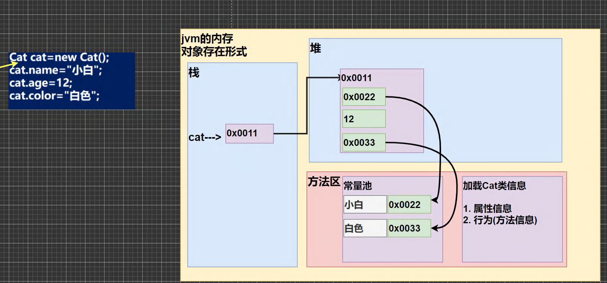

### 属性的注意事项和细节说明

1. 属性大的定义语法同变量: `访问修饰符 属性类型 属性名`

​	public protected 默认 private

2. 属性的定义类型可以为任意类型, 包含基本类型或引用类型
3. 属性如果不赋值, 有默认值, 规则和数组是一样的; (int,short,byte,long,都是0;  float,double都是0.0; char \u0000, boolean false, String null)

```java

public class PropertiesDetail { 

	//编写一个main方法
	public static void main(String[] args) {
		//创建Person对象
		//p1 是对象名(对象引用)
		//new Person() 创建的对象空间(数据) 才是真正的对象
		Person p1 = new Person();

		System.out.println("\n当前这个人的信息");
		System.out.println("age=" + p1.age + " name=" 
				+ p1.name + " sal=" + p1.sal + " isPass=" + p1.isPass) ;
	}
}

class Person {
	//四个属性
	int age;
	String name;
	double sal;
	boolean isPass;
}
```

### 如何创建对象

1. 先声明再创建: 

```java
Cat cat;
cat = new Cat();
```

2. 直接创建

```java
Cat cat = newCat();
```

### 如何访问属性

- **基本语法:**

    - 对象名, 属性名;

- **类和对象的内存分配机制**

    - 思考:

    - ```java
        Person p1 = new Person();
        p1.age = 10;
        p1.name = "Harry";
        Person p2 = p1;
        System.out.print(p2.age)
        ```

    - 在这种情况下的p2.age应该是多少?


> **个人思考:**
>
> 这个本质上来讲和数组是一样的, 理论上都是把一个东西point toward to another thing, 那么`p2.age` will have no doubt same to p1.age

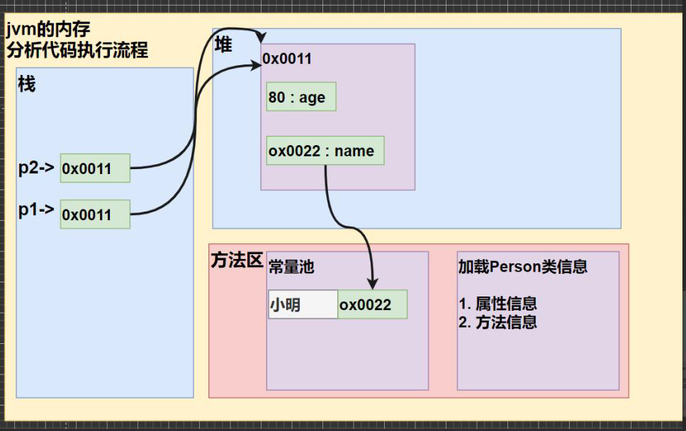

### 类和对象的内存分配机制

***

#### Java内存的结构分析

- Stack - 栈: 一般存放基本数据类型(局部变量)
- Heap - 堆: 存放对象(Cat cat, 数组等)
- Method Area - 方法区: 常量池(常量, 比如字符串), 类加载信息
- Map - 示意图: [Cat(name,age,price)]

#### Java创建对象的流程分析

```java
Person p = new Person;
p.name = "Harry";
p.age = 18;
```

1. 先价值Person类的信息(属性和方法信息) - 只加载一次
2. 在heap中分配空间, 进行默认初始化
3. 把地址赋给`p`, `p`就指向对象
4. 进行指定初始化, 比如`p.name - jack;`

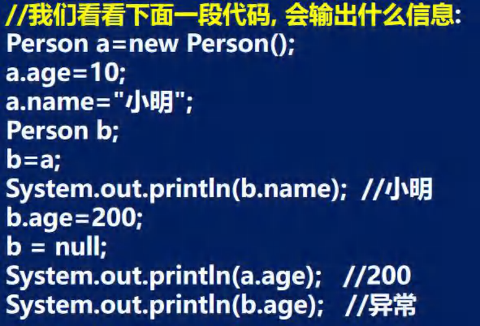

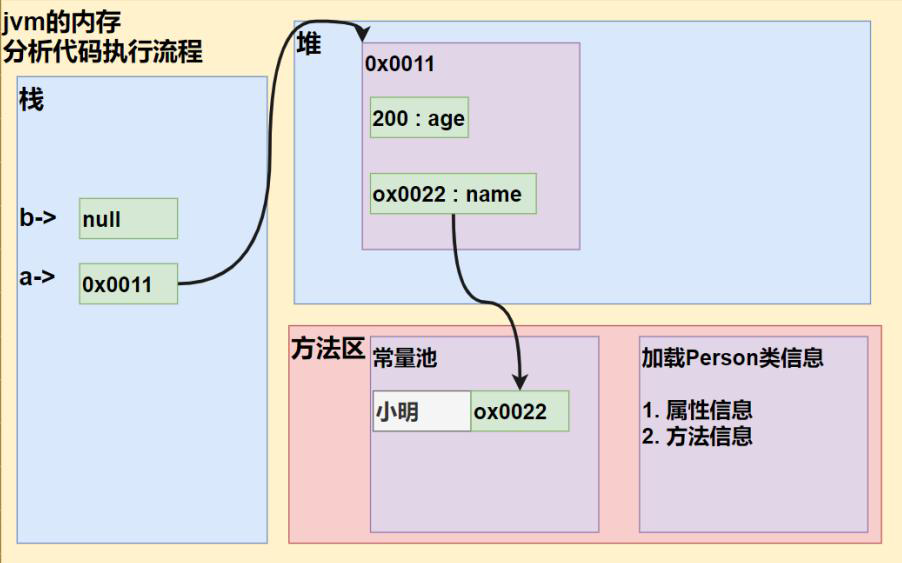

# 成员方法

***

#### 基本介绍:

- 在部分情况下, 我们需要对成员方法进行定义, 比如如果把人类作为对象, 那么除了一些基本功能外, 人类还有一些复杂行为, 比如: 说话, 吃饭, 跑步...
- 在这种情况下, 我们就需要成员方法来完成, 那么就需要对Person类完善

#### 定义

```java
public 返回数据类型 方法名(形参列表..) {
    方法体语句;
    return 返回值;
}
```

1. 参数列表: 表示成员方法输入cal(int n)
2. 数据类型(返回类型): 表示成员方法输出, void表示没有返回值
3. 方法主体: 表示为了实现某一功能代码块
4. return语句不是必须的

***

#### 快速入门

- 方法的调用

    - 方法写好后, 如果不去调用, 那么就不会输出
    - 先创建对象, 然后调用方法即可

    - *`public` 表示方法是公开*
    - *`void`： 表示方法没有返回值*

    - *`speak()` : speak 是方法名， **() 形参列表***
        - `(int n)` 形参列表啊, 表示当前有一个形参n, 可以接受用户输入
    - *`{}` 方法体，可以写我们要执行的代码*
    - *`System.out.println("**");` 表示我们的方法就是输出一句话*
    - *`(int sum1, int sum2)` 形参列表, 两个形参, 可以接受用户传入的两个数*


- 计算机一旦在main方法中发现了调用方法, 那么就会直接去对应类中去调用该方法, 也就是执行对应的语句块

```java
public class HumanObject {
    // 主方法
    public static void main (String[]args){
        Person1 person = new Person1();
        person.speak(); // 调用方法
        person.cal1();
        person.cal2(5);
        int returnRes = person.getSum(10,20);
        System.out.println(returnRes);
    }
}

class Person1{
    String name;
    int age;
    public void speak(){
        System.out.println("a");
    }
    public void cal1(){
        int res = 0;
        int sum = 0;
        for (int i = 0; i < 100; i++){
            res++;
            sum += res;
        }
        System.out.println(sum);
    }
    public void cal2(int n){
        int res = 0;
        for (int i = 1; i<=n; i++){
            res +=i;
        }
        System.out.println(res);
    }
    public int getSum(int num1, int num2){
        return num1+num2;
    }
}
```

***

#### 方法调用机制原理


***

#### 成员方法的必要性

1. 遍历一个数组, 输出数组的各个元素值

    - **传统方法**: 直接遍历, 单个for循环, 代码复用性很差, 维护/修改麻烦

    - ```java
        public class Method2 {
            public static void main (String[]args){
                int [][] map = {{0,0,1},{1,1,1},{1,1,3}};
                for (int i = 0; i< map.length; i++){
                    for (int j = 0; j<map[i].length; j++){
                        System.out.print(map[i][j]+" ");
                    }
                }
            }
        }
        ```

    - **对象方法**: 调用方法

    - 把输出的功能写在一个类的方法中, 然后直接调用该方法即可

    - ```java
        public class Method2 {
            public static void main (String[]args){
                int [][] map = {{0,0,1},{1,1,1},{1,1,3}};
                Tools tools = new Tools();
                tools.printArray(map);
        
            }
        }
        class Tools {
            public void printArray(int[][]map){
                for (int i = 0; i< map.length; i++){
                    for (int j = 0; j<map[i].length; j++){
                        System.out.print(map[i][j]+" ");
                    }
                }
            }
        }
        ```

***

#### 注意事项和使用细节

- 访问修饰符(作用是控制方法使用的范围)
    - 如果不写就默认是默认访问
    - 有四种: public protected private 默认
        - **private**: 用private关键字修饰的属性和方法只能在该类的大括号内访问，出了这个类就不能被访问了。当一个子类继承一个父类的属性和方法时，若父类的属性或方法被private修饰，那么子类就不可以继承该属性或方法
        - **default**: default关键字修饰的属性或方法只能在同一个包中的所有类访问，且必须是同级的包，在一个包中的子包也不可以访问。但我们在定义属性和方法时不需要将default关键字写出来，没有关键字修饰的属性或方法就是包访问权限
        - **protected**: 被protected关键字修饰的属性或方法只能在同一个包中的所有类和不同包中的子类访问，出了一个包但不是该类的子类的话就不可以访问
        - **public**: 被public关键字修饰的属性或方法可以在任意位置被访问，没有使用的权限
- 返回数据类型
    - 一个方法最多有一个返回值
    - 返回类型可以为任意类型, 包含基本类型或引用类型
    - 如果方法要求有**返回数据类型**, 则方法体中最好的执行语句必须为**return值**; 而且要求返回值必须和return的值类型一致或兼容
    - 如果方法是`void`则方法体中可以没有return语句, 或者只写 return
- 方法名:
    - 遵循驼峰命名法, 最好见名知义, 表达出该功能的意思即可, 比如 得到两个数的和 getSum

```java

public class MethodDetail { 

	
	public static void main(String[] args) {

		AA a = new AA();
		int[] res = a.getSumAndSub(1, 4);
		System.out.println("和=" + res[0]);
		System.out.println("差=" + res[1]);


		//细节: 调用带参数的方法时，一定对应着参数列表传入相同类型或兼容类型 的参数
		byte b1 = 1;
		byte b2 = 2;
		a.getSumAndSub(b1, b2);//byte -> int 
		//a.getSumAndSub(1.1, 1.8);//double ->int(×)
		//细节: 实参和形参的类型要一致或兼容、个数、顺序必须一致
		
		//a.getSumAndSub(100);//× 个数不一致
		a.f3("tom", 10); //ok
		//a.f3(100, "jack"); // 实际参数和形式参数顺序不对
		
	}
}

class AA {

	//细节: 方法不能嵌套定义
	public void f4() {
		//错误
		// public void f5() {

		// }
	}

	public void f3(String str, int n) {

	}

	//1. 一个方法最多有一个返回值  [思考，如何返回多个结果 返回数组 ]
	public int[] getSumAndSub(int n1, int n2) {

		int[] resArr = new int[2]; //
		resArr[0] = n1 + n2;
		resArr[1] = n1 - n2;
		return resArr;
	}
	//2. 返回类型可以为任意类型，包含基本类型或引用类型(数组，对象)
	//   具体看 getSumAndSub
	//   
	
	//3. 如果方法要求有返回数据类型，则方法体中最后的执行语句必须为 return 值; 
	//   而且要求返回值类型必须和return的值类型一致或兼容
	public double f1() {

		double d1 = 1.1 * 3;
		int n = 100;
		return n; // int ->double 
		//return d1; //ok? double -> int 
	}

	public void f2() {

		System.out.println("hello1");
		System.out.println("hello1");
		System.out.println("hello1");
		int n = 10;
		//return ;
	}

}
```

- **形参列表**:
    - 一个方法可以有0个参数，也可以有多个参数，中间用逗号隔开，比如`getSum(int n1,int n2)`
    - 参数类型可以为任意类型，包含基本类型或引用类型，比如`printArr(int[][]map)`
    - 调用带参数的方法时，一定对应着参数列表传入相同类型或兼容类型的参数！`getSum`
    - 方法定义时的参数称为形式参数，简称形参；方法调用时的传入参数称为实际参数，简称实参,实参和形参的类型要一致或兼容、个数、顺序必须一致！
- 方法体
    - 里面写完成功能的具体的语句，可以为输入、输出、变量、运算、分支、循环、方法调用，但里
        面不能再定义方法！即：方法不能嵌套定义。

```java
public class MethodDetail02 {

    //编写一个main方法
    public static void main(String[] args) {

        A a = new A();
        //a.sayOk();

        a.m1();
    }
}

class A {
    //同一个类中的方法调用：直接调用即可
    //

    public void print(int n) {
        System.out.println("print()方法被调用 n=" + n);
    }

    public void sayOk() { //sayOk调用 print(直接调用即可)
        print(10);
        System.out.println("继续执行sayOK()~~~");
    }

    //跨类中的方法A类调用B类方法：需要通过对象名调用

    public void m1() {
        //创建B对象, 然后在调用方法即可
        System.out.println("m1() 方法被调用");
        B b = new B();
        b.hi();

        System.out.println("m1() 继续执行:)");
    }
}

class B {

    public void hi() {
        System.out.println("B类中的 hi()被执行");
    }
}
```

### 实战

1. 编写类AA ，有一个方法：判断一个数是奇数odd 还是偶数, 返回boolean

```java
public class MethodP1 {
    // 编写类AA ，有一个方法：判断一个数是奇数odd 还是偶数, 返回boolean
    public static void main(String[] args) {
        OddNumber1 oddNumber1 = new OddNumber1();

        if (oddNumber1.OddNum(1)){
            System.out.println("Yes");
        } else System.out.println("No");
    }
}
class OddNumber1{
    public boolean OddNum(int num){
        return num % 2 != 0 ? true: false;
    }

}
```

2. 编写一个类, 使其可以根据行, 列, 字符大于对应的行数和烈属的字符

```java
public class MethodP2 {
    public static void main(String[] args) {
        ArrayShape arrayShape = new ArrayShape();
        arrayShape.sharpNumber(4,4, (char) 33);
    }
}

class ArrayShape{
    public void sharpNumber(int row, int column, char c){
        for (int i = 0; i< row; i++){
            for (int j = 0; j< column; j++){
                System.out.print(c);
            }
            System.out.println();
        }
    }
}
```

***

# ***成员方法传参机制***🌟

看案例, 分析结果: 

```java

public class MethodParameter1 {

    //编写一个main方法
    public static void main(String[] args) {

        int a = 10;
        int b = 20;
        //创建AA对象 名字 obj
        ww obj = new ww();
        obj.swap(a, b); //调用swap

        System.out.println("main方法 a=" + a + " b=" + b);//a=10 b=20
    }
}

class ww {
    public void swap(int a,int b){
        System.out.println("a和b交换前的值a=" + a + "b=" + b);//a=10 b=20
        //完成了 a 和 b的交换
        int tmp = a;
        a = b;
        b = tmp;
        System.out.println("a和b交换后的值a=" + a + "b=" + b);//a=20 b=10
    }
}
```

但是输出结果是: 

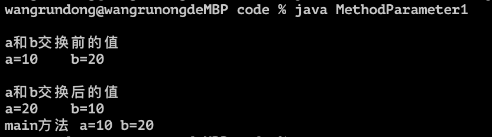

- **原因**

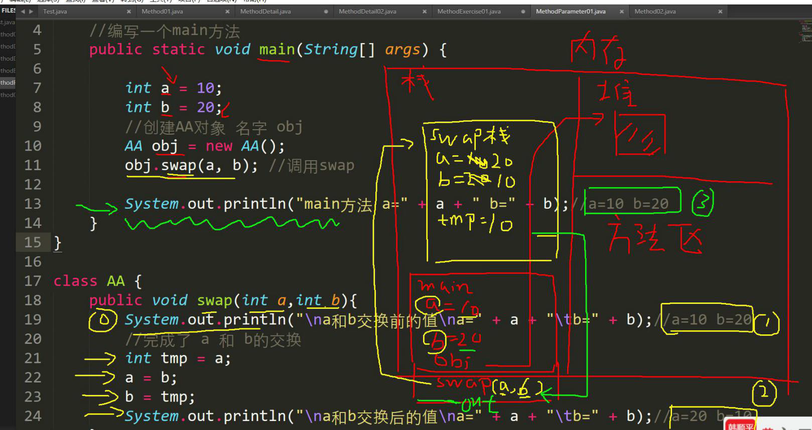

- 在内存中, 栈都是独立存在的, 也就是说, 尽管a和b在swap栈中发生了交换, 但是问题是在main方法中并没有发生交换,因此输出仍旧是a=10, b=20

- 基本数据类型, 传递的是*值*, 而形参的任何改变不影响实参


```java

public class MethodParameter02 { 
	//编写一个main方法
	public static void main(String[] args) {
		//测试
		B b = new B();
		int[] arr = {1, 2, 3};
		b.test100(arr);//调用方法
		System.out.println(" main的 arr数组 ");
		//遍历数组
		for(int i = 0; i < arr.length; i++) {
            System.out.print(arr[i] + "\t");
        }
		System.out.println();

	}
}
class B {
	//B类中编写一个方法test100，
	//可以接收一个数组，在方法中修改该数组，看看原来的数组是否变化
	public void test100(int[] arr) {
		arr[0] = 200;//修改元素
		//遍历数组
		System.out.println(" test100的 arr数组 ");
		for(int i = 0; i < arr.length; i++) {
			System.out.print(arr[i] + "\t");
		}
		System.out.println();
	}
}
```

输出为都是一样的, 被修改后的arr数组

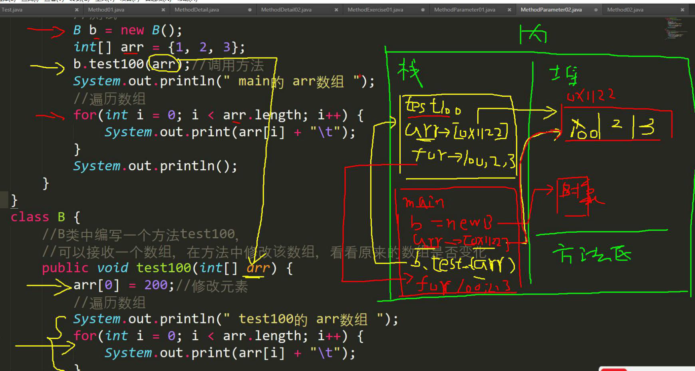

-  **原因:** 
    - 数组都是同一个堆, 因此就算不在同一个地方改, 也是一样的, 具体原因是在前面的数组有具体的原因和内存分析
    - 尽管栈是相互独立的, 但是栈的内存指示, 也就是堆: 是完全相同的, 他们都直接指向堆, 而不在栈中直接运算
    - 因此, 相互独立的栈在修改后指向的数组也会变

#### 成员方法返回类型是引用类型

1. 编写一个方法, 可以打印二维数组

    ```java
    public class PrintTwoDimensionalArray {
        public static void main (String[]args){
            int [][] arr = {{0,0,1},{1,1,1},{1,1,3}};
            printArray printArray = new printArray();
            printArray.print2Array(arr);
        }
    }
    class printArray{
        public void print2Array(int [][]arr){
            for (int i = 0; i< arr.length; i++){
                for (int j = 0; j< arr.length; j++){
                    System.out.print(arr[i][j]);
                }
                System.out.println();
            }
        }
    }
    ```

2. 编写一个方法copyPerson，可以复制一个Person 对象，返回复制的对象。克隆对象， 注意要求得到新对象和原来对象是两个独立的对象，只是他们的属性相同

```java
public class MethodExercise02 {
    //编写一个main 方法
    public static void main(String[] args) {
        Person p = new Person();
        p.name = "milan";
        p.age = 100;
//创建tools
        MyTools tools = new MyTools();
        Person p2 = tools.copyPerson(p);
//到此p 和p2 是Person 对象，但是是两个独立的对象，属性相同
        System.out.println("p 的属性age=" + p.age + " 名字=" + p.name);
        System.out.println("p2 的属性age=" + p2.age + " 名字=" + p2.name);
//这里老师提示： 可以同对象比较看看是否为同一个对象
        System.out.println(p == p2);//false
    }
}
class Person {
    String name;
    int age;
}
class MyTools {
    //编写一个方法copyPerson，可以复制一个Person 对象，返回复制的对象。克隆对象，
//注意要求得到新对象和原来的对象是两个独立的对象，只是他们的属性相同
//
//编写方法的思路
//1. 方法的返回类型Person
//2. 方法的名字copyPerson
//3. 方法的形参(Person p)
//4. 方法体, 创建一个新对象，并复制属性，返回即可
    public Person copyPerson(Person p) {
//创建一个新的对象
        Person p2 = new Person();
        p2.name = p.name; //把原来对象的名字赋给p2.name
        p2.age = p.age; //把原来对象的年龄赋给p2.age
        return p2;
    }
}
```

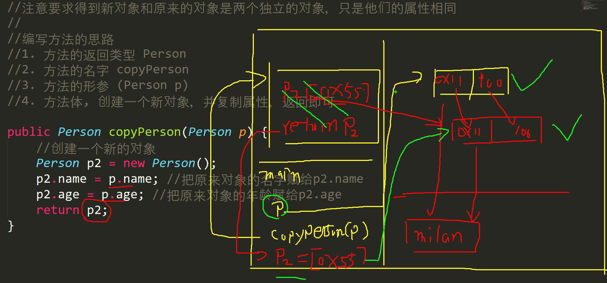

***

### 方法递归(recursion)调用🌟

- ***基本介绍**:* 递归就是自己调用自己, 每次调用的时候传入不同的变量, 方便变成解决复杂问题, 同时可以让代码变得简洁

思考: 输出什么?

```java
public class Recursion1 {
    public static void main (String[]args){
        recursion1Test recursion1Test = new recursion1Test();
        recursion1Test.test(4);
    }
}

class recursion1Test{
    public void test(int n){
        if (n>2){
            test(n-1);
        }
        System.out.println("n="+n);
    }
}
```

输出: 

```
n=2
n=3
n=4

Process finished with exit code 0
```

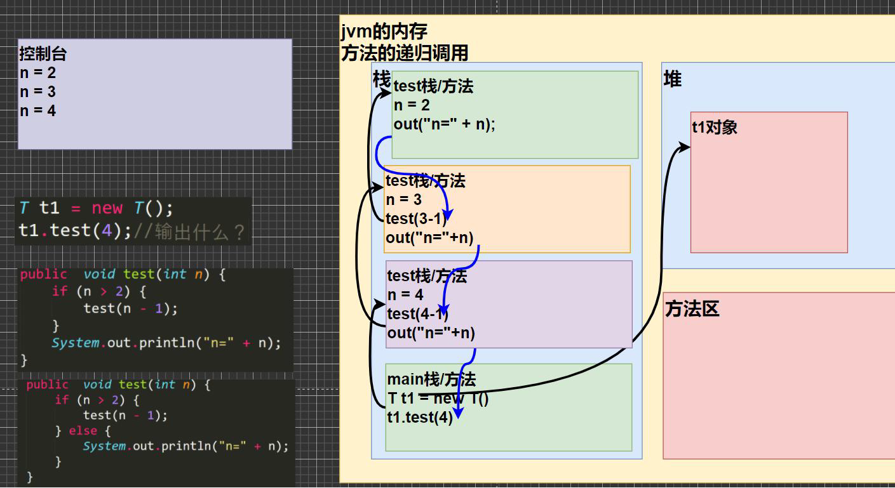

***

- 阶乘

```java
import java.awt.*;

public class Recursion1 {
    public static void main (String[]args){

        int res = recursion1Test.factorial(5);
        System.out.println(res+" a");
    }
}

class recursion1Test{
    public int factorial(int m){
        if (m==1){
            return m;
        } else {
            return factorial(m-1)*m;
        }

    }
}
```

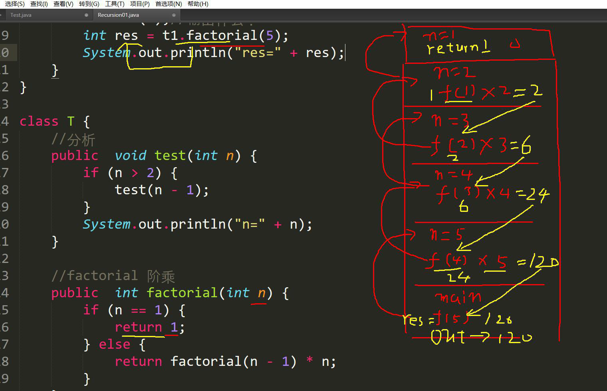

***

#### 递归的重要规则‼️

1. 执行一个方法时, 就创建一个新的受保护的独立空间(栈空间)
2. 方法的局部变量是独立的, 不会互相影响, 比如n变量
3. 如果方法中使用的是引用类型变量(数组), 就会 共享该引用类型的数据
4. 递归必须向递归的条件逼近, 否则就是无限递归, 出现`StackOverflowError`
5. 当一个方法执行完毕, 或者遇到return, 就会返回, 遵循谁调用, 就把结果返回给谁, 同时当方法执行完毕或者返回的时候, 该方法也就执行完毕

***

#### 实战练习

1. 使用递归的方式求出斐波那契数列

```java
public class FibonacciSequence {
    public static void main (String[]args){
        T t = new T();
        System.out.println(t.Fib(7));
    }
}
class T {
    public int Fib(int i) {
        if (i > 0) {
            if (i == 1 || i == 2) {
                return 1;
            } else {
                return Fib(i-1) + Fib(i-2);
            }
        }
        else System.out.println("bigger than -1");
        return i;
    }
}
```

### 关于递归的个人理解

[具体的话可以去看这篇blog, 讲的很清晰](https://blog.csdn.net/qq_35427589/article/details/124448494)

刚刚遇到一个问题, 才发现自己上面没太理解递归的原理

- 这里是源码, 可以试着分析一下

```java
public class Demo01DiGui {
	public static void main(String[] args) {
		// a();
		b(1);
	}
	
	/*
	 * 3.构造方法,禁止递归
	 * 编译报错:构造方法是创建对象使用的,不能让对象一直创建下去
	 */
	public Demo01DiGui() {
		//Demo01DiGui();
	}


	/*
	 * 2.在递归中虽然有限定条件，但是递归次数不能太多。否则也会发生栈内存溢出。
	 * 4993
	 * 	Exception in thread "main" java.lang.StackOverflowError
	 */
	private static void b(int i) {
		System.out.println(i);
		//添加一个递归结束的条件,i==5000的时候结束
		if(i==5000){
			return;//结束方法
		}
		b(++i);
	}

	/*
	 * 1.递归一定要有条件限定，保证递归能够停止下来，否则会发生栈内存溢出。 Exception in thread "main"
	 * java.lang.StackOverflowError
	 */
	private static void a() {
		System.out.println("a方法");
		a();
	}
}
```

- 递归的公式: 

- ```java
    public void recur(int level , int param){
        // terminator
        if(level > MAX_LEVEL){
            return;
        }
        // process current logic
        process(level, param);
        // drill down
        recur(level:level+1 , newParam);
        // restore current status
    }
    ```

- 然后这里是递归的flow chart

- 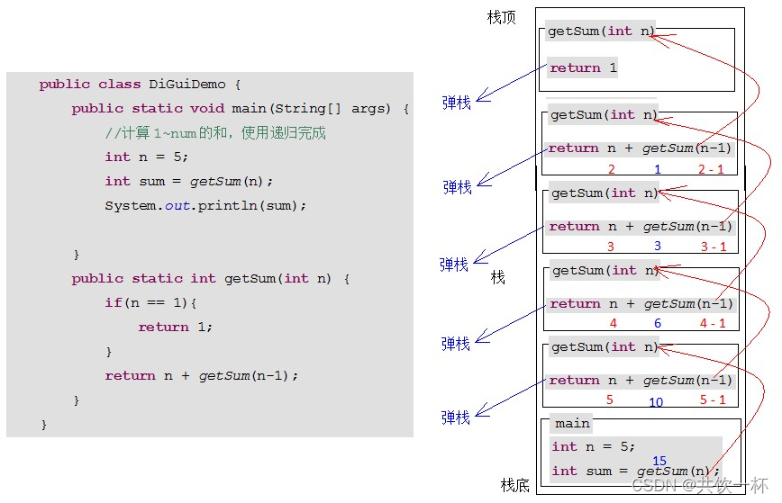

> in another word, whenever the fucntion met a thing that implies it self, then it need to go over it and re-calculate it again.

也就是所谓的弹栈

从5一路弹到最后... 弹到1

那么..先做一道leetcode题试试: 难度`中等`

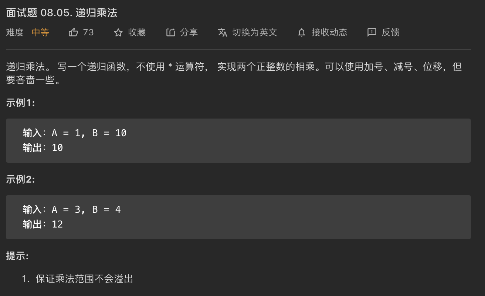

- 这里的意思就是让你无限相加罢了. 那么也就是说... 递归出来一个无限相加的乘法, 把乘法归到最初始的状态, 具体该怎么做呢?很简单, 和我们上面看到的方法是一模一样的, 使用递归算法: 

- ```java
    class Solution {
        public int multiply(int A, int B) {
            int sum;
            if (B==0){
                return B;
            } else {
                return A+multiply(A, B-1);
            }
        }
    }
    ```

- 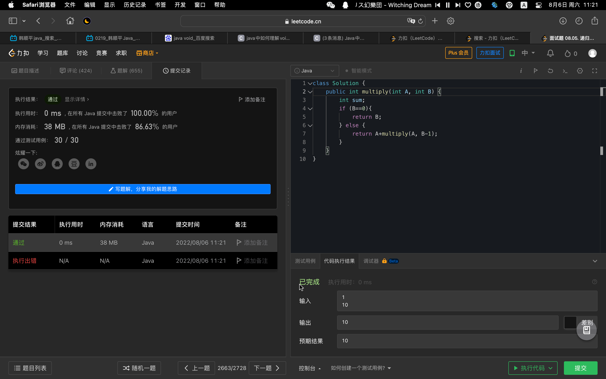

泻药

***

2. 猴子吃桃子问题：有一堆桃子，猴子第一天吃了其中的一半，并再多吃了一个！以后每天猴子都吃其中的一半，然后再多吃一个。当到第10天时，想再吃时（即还没吃）发现只有1个桃子了。问题：最初共多少个桃子？

```java
public class RecursionExercise {
    public static void main (String[]args){
        int day = 10;
        Peach peach = new Peach();
        peach.peach(10);
        System.out.println(peach.peach(7));
    }


}
class Peach{
    public int peach(int day) {
        if(day == 10) {
            return 1;
        } else if ( day >= 1 && day <=9 ) {
            return (peach(day + 1) + 1) * 2);
        } else {
            System.out.println("day 在1-10");
            return -1;
        }
    }
}
```

- 这里重要的是思路分析的逆推, 以及对逻辑: `peach(day + 1) + 1) * 2`的观察


### 方法递归调用(实战应用)

1. 汉诺塔

```java
import java.util.Scanner;

public class hanoTower {
    public static void main(String[] args) {
        Scanner in = new Scanner(System.in);
        System.out.println("请输入圆盘的数量");
        int num = in.nextInt();
        hanoi(num, 'A', 'B', 'C');//起始柱、辅助柱、目标柱默认为A、B、C
    }

    //汉诺塔问题实现
    //a存放起始柱，b存放辅助柱、c存放目标柱
    public static void hanoi(int num, char a, char b, char c){
        if (num == 1) {
            System.out.println("第" + num + "个圆盘从" + a + " -> " + c);
        }else{
            hanoi(num - 1, a, c, b);//借助c把第 num 个以外的圆盘从a移动到b
            System.out.println("第" + num + "个圆盘从" + a + " -> " + c);//把第num个从a移动到c
            hanoi(num - 1, b, a, c);//借助a把第 num 个以外的圆盘从b移动到c
        }
    }

}

```


2. 八皇后

```java
public class eightqueen {
    public static int MAXQUEEN = 8;   //皇后个数，也是棋盘行列数
    public static int[][] Board = new int[MAXQUEEN][MAXQUEEN];    //初始化棋盘
    private static int count;

    public static void startTest(Todo Todo, int row){
        //第0列开始
        for (int col = 0; col < MAXQUEEN; col++) {
            //检查位置是否可以放棋子
            if (Todo.checkBoard(MAXQUEEN, row, col, Board) == 1){
                if (row == MAXQUEEN - 1){
                    count++;
                }
                //递归，向下一行前进
                if (row < MAXQUEEN - 1){
                    startTest(Todo, ++row);
                    //回退上一个栈
                    --row;
                }
            }
            //重新赋值为0，进行下一次判断
            Board[row][col] = 0;
        }
    }

    public static void main(String[] args) {
        int row = 0;
        Todo Todo1 = new Todo();
        startTest(Todo1, row);

        System.out.println("摆放一共有" + count + "种");
    }
}

class Todo {
    //定义横竖斜方向上是否有棋子
    public static boolean flag = true;
    //检查棋盘
    public int checkBoard(int MAXQUEEN, int row, int col, int[][] Board){
        //行方向上
        for (int i = 0; i < MAXQUEEN; i++) {
            if (Board[row][i] == 1){
                return 0;
            }
        }
        //列方向上
        for (int i = 0; i < MAXQUEEN; i++) {
            if (Board[i][col] == 1){
                return 0;
            }
        }
        //右下方向上
        for (int i = row, j = col; i < MAXQUEEN && j < MAXQUEEN; i++, j++) {
            if (Board[i][j] == 1){
                return 0;
            }
        }
        //左上方向上
        for (int i = row, j = col; i >= 0 && j >= 0; i--, j--) {
            if (Board[i][j] == 1){
                return 0;
            }
        }
        //左下方向上
        for (int i = row, j = col; i < MAXQUEEN && j >= 0; i++, j--) {
            if (Board[i][j] == 1){
                return 0;
            }
        }
        //右上方向上
        for (int i = row, j = col; i >= 0 && j < MAXQUEEN; i--, j++) {
            if (Board[i][j] == 1){
                return 0;
            }
        }
        if (flag) {
            //此点符合要求，可以下
            Board[row][col] = 1;
            //如果已经到最后一行，则打印棋盘
//            if (row == MAXQUEEN - 1){
//                printBoard(MAXQUEEN, Board);
//            }
            //可以放
            return 1;
        }
        return 0;
    }
    //打印棋盘
    public static void printBoard(int MAXQUEEN, int[][] Board){
        for (int i = 0; i < MAXQUEEN; i++) {
            for (int j = 0; j < MAXQUEEN; j++){
                System.out.print(Board[i][j] + " ");
            }
            System.out.println();
        }
        System.out.println("================");
    }
}


```

#### 依旧是递归:

[斐波那契数列另外一个方法的演示](https://leetcode.cn/problems/fei-bo-na-qi-shu-lie-lcof/solution/mian-shi-ti-10-i-fei-bo-na-qi-shu-lie-dong-tai-gui/)


递归的时间复杂度是随着n的增长而增长的`T(n)=o(f(n))` , 也是因为递归的这一个特性, 让我们leetcode中的[这一题](https://leetcode.cn/problems/fei-bo-na-qi-shu-lie-lcof/solution/)直接使用递归来进行取模会导致超时, 这时候就需要换一个思路, 将代码改进为 

```java

class Solution {
    public int fib(int n) {
        int a = 0, b = 1, sum;
        for(int i = 0; i < n; i++){
            sum = (a + b) % 1000000007;
            a = b;
            b = sum;
        }
        return a;
    }
}
```

- 具体分析
- 1. a = 0, b = 1; sum = (a+b)% 1000000007 = 1;
    2. a = b = 1;
    3. b = sum = 1;
- 一轮结束
    1. a = 1, b = 1; sum = (a+b)% 1000000007 = 2;
    2. a = b = 1;
    3. b = sum = 2;
- 二轮
- 1. a = 1, b = 2; sum = (a+b)% 1000000007 = 3;
    2. a = b = 2;
    3. b = 3;
- Round 3
- 1. a = 2, b = 3; sum = 5;
    2. a = b = 3;
    3. b = 5;
- ...

***

# 方法重载(Overload)

- 基本介绍
    - java中运行同一个类中, 多个命名方法的存在


