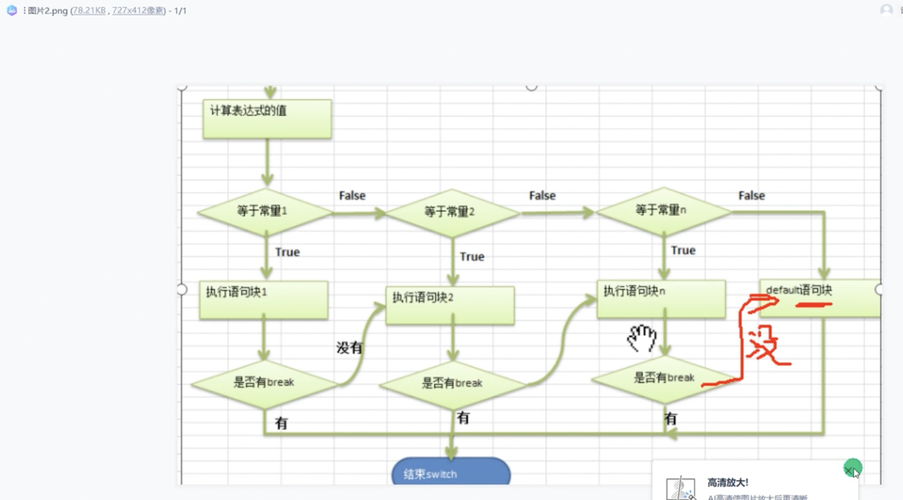

# 流程控制介绍:
1. 顺序控制
    - 介绍:
      > 程序从上到下逐行的执行, 中间没有任何判断和跳转
    - Java定义变量的时候采用的合法的**向前引用**. 如:
    - `int1 = 12, int num2 = num 1+2`
    - `int num2 = num1 +2; int num1 = 12` 错误
2. 分支控制 if-else 介绍
### 单分支基本语法:
      ```java
      if(条件表达式){
        执行代码块;
      }
      ```
      表达式为true的时候, 就会执行{}内的代码. 如果为false, 就不执行.

```java
import java.util.Scanner;
public class if01 {
    public static void main(String[] args) {
        // 编写一个程序, 判断人的年龄是否大于18岁
        // 思路分析: 
        // 1. 接受输入的年龄, 定义scanner对象
        // 2. 保存年龄到变量
        // 3. if判断, 并且输出
        Scanner myScanner = new Scanner(System.in);
        System.out.print("YourAge?");
        int age = myScanner.nextInt();
        if (age>18){
            System.out.print("Your age is larger than 18");
        }
        System.out.print("Continue...");
    }
}
```
### 双分支:
   - 基本语法: 
```java
if(条件表达式){
  执行代码块1;
}
else{
  执行代码块2;
}
```
 - 案例实战
```java
import java.util.Scanner;
public class if02 {
    public static void main(String[] args) {
        Scanner myScanner = new Scanner(System.in);
        System.out.print("YourAge?");
        int age = myScanner.nextInt();
        if (age>18){
            System.out.print("Your age is larger than 18");
        } else{
            System.out.print("OK");
        }
        System.out.print("Continue...");
    }
}
```
 - 练习题
1. 声明两个double型变量, 判断第一个大于10.0, 第二个小于20.0, print两数之和


```java
public class if03 {
    public static void main(String[] args) {
        
        double num1 = 20.0d;
        double num2 = 19.0d;
        if (num1 > 10.0){
            if (num2 < 20.0){
                System.out.print(num1+num2);
            } 
        } 
    }
}
```
老师思路: 
```java
public class if03 {
    public static void main(String[] args) {
        
        double num1 = 20.0d;
        double num2 = 19.0d;
        if (num1 > 10.0 && num2 < 20.0){
                System.out.print(num1+num2);
            } 
        } 
    }
}
```
2. 定义两个变量int, 判断两者之和, 是否能又被3又被5整除

 - 和老师一模一样
```java
public class if04 {
    public static void main(String[] args) {
        //定义两个变量int, 判断两者之和, 是否能又被3又被5整除
        int num1 = 45;
        int num2 = 15;
        int su = num1 +num2;
        if (su%3 == 0 && su%5 ==0){
            System.out.print("Yes");
        }else{
            System.out.print("No");
        }
    }
}
```

3. 判断一个年份是否是闰年, 年份能被4整除, 但不能被100整除; 能被400整除
```java
public class if05 {
    public static void main(String[] args) {
        int year = 2004;
        if (year%4==0 && year%100!=0){
            if (year%400==0){
        } System.out.print("yes");
            }
        }
    }
```

**or**

```java
public class if05 {
    public static void main(String[] args) {
        int year = 2004;
        if (year%4==0 && year%100!=0 || year%400==0){
        } System.out.print("yes");
            }
        }
```
### 多分支
 - 基本语法:
```java 
if (条件表达式){
  执行代码块1;
}
else if(条件代码块){
  执行代码块2;
}
else{
  执行代码块3;
}
```
> [!NOTE]
>  - 当条件表达式1成立的时候, 立即执行代码块1
>  - 如果表达式1不成立, 采取判断表达式2是否成立
>  - 如果表达式2成立, 就执行代码块
>  - 以此类推, 如果所有代码块都不成立, 就直接直接执行else的代码块

 - 实战演习
   - 设定一个可以输入的分数
   - 如果分数大于80, 输出
   - 如果分数小于80且大于60, 输出
   - 如果分数小于60, 输出


 - 思路分析: 
   - 先引用一个Scanner对象
   - if - else if - else


```java
import java.util.Scanner;
public class if06 {
    public static void main(String[] args) {
        try (Scanner MyScanner = new Scanner(System.in)) {
            System.out.print("Your mark?");
            int mark = MyScanner.nextInt();
            if (mark >= 80){
                System.out.print("GoodMark");
            }
            else if (mark < 80 && mark >60){
                System.out.print("OK");
            }
            else{
                System.out.print("BadMark");
            }
        }
        }
    }
```

 - 改进: 
   - 如果输入小于0或大于100的数仍会正常运作

```java
import java.text.BreakIterator;
import java.util.Scanner;
public class if06 {
    public static void main(String[] args) {
        try (Scanner MyScanner = new Scanner(System.in)) {
            System.out.print("Your mark?");
            int mark = MyScanner.nextInt();
        if (mark <=100 && mark>=0){
            if (mark >= 80){
                System.out.print("GoodMark");
            }
            else if (mark < 80 && mark >60){
                System.out.print("OK");
            }
            else{
                System.out.print("BadMark");
            }
        } else {
            System.out.print("Wrong");
        }
        }
        }
    }
```
# 嵌套分支
 - 基本介绍: 在一个分支结构中又完整的嵌套了另一个完整的分支结构, 里面的分支的结构成为内存分支, 外面的分支结构称为外层分支
   - 不要超过三层
 - 基本语法
```java
if(){
  if(){
    //if-else
  } else{
    //if-else
  }
}
```
 - 应用案例
   - 如果分数大于8, pass
   - 根据性别区分男女
   - 输入成绩和性别, 进行判断和输出信息
```java
import java.util.Scanner;
public class if07 {
    public static void main(String[] args) {
            Scanner MyScanner = new Scanner(System.in);
            System.out.println("Your mark?");
            double mark = MyScanner.nextDouble();
            if (mark >= 10.0){
                System.out.println("YourGender?");
                char gender = MyScanner.next().charAt(0); 
                if (gender=='m'){
                    System.out.println("Male");
                } else if (gender=='f'){
                    System.out.println("Female");
                } else {
                    System.out.println("Wrong");
                }
            } else {
                System.out.println("Not pass");
            }
            
        }
    }
```

> [!ATTENTION]
> 遗留问题:
>  - char类型, 换成GBK编码直接可以`男`, `女`, 但是英文就只能m和f
>  - 改成String直接跑不动, 该怎么做?


# Switch
1. Switch 关键字, 表示switch分支
2. 表达式对应一个值
3. case常量1: 当表达式的值等于常量1, 就执行语句块1
4. `break`: 表示退出switch
5. 如果和case常量1匹配, 就执行语句块1, 如果没有匹配, 就继续匹配case常量2
6. 如果一个都没配上, 就直接执行default

```java
switch{
  case 常量1:
  语句块1; // 多条或一条
  break;
  case 常量2;
  语句块2;
  break;
  ...
}
```
### 主要流程图



 - 计算机首先计算表达式的值
   - 和常量1进行匹配, 如果匹配
     - 执行语句块1
     - 如果没有break, 直接执行语句块2
       - 这里的执行是不进行与常量块2的判断的
   - 如果和常量1不匹配, 判断和常量2
     - 执行语句块2
     - 如果没有break, 继续**穿透**
   - 如果两个都不匹配, 那就执行`default`语句块
   - 如果后续有`break`语句, 那就退出该程序

> ![ATTENTION]
> 后面可能是英文写了, mac符号切换太伞兵

### The Branch Selection of `Switch`

```java
import java.util.Scanner;
public class Switch_1 {
    public static void main(String[]args) {
/*
 * Goal: write a program, when a~g is input in the termal, return: monday...
 * Analysis: 
 */
        Scanner myScanner = new Scanner(System.in);
        System.out.println("Please type in a number");
        char c1 = myScanner.next().charAt(0);
        // In java, as long as there's a return of value, it is considered as a function
        switch (c1) {
            case 'a':
                System.out.println("Today is Monday");
                break;
            case 'b':
                System.out.println("Today is Tuesday");
            default:
                System.out.println("You've put a wrong number");
                break;
        }
    }
}
```

### Details about `Switch`
 - **注意事项和细节讨论:**
   1. 表达式数据类型, 应该和case后常量类型抑制, 或可以自动转换成可以相互比较的类型
   2. switch中表达式的返回值必须是(byte, short, int, char, enum, String)
   3. case子句中的值必须是常量, 而不能是var
   4. default


