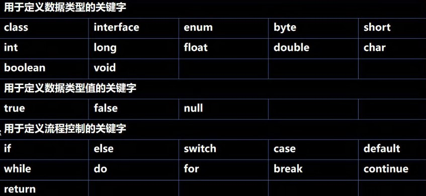
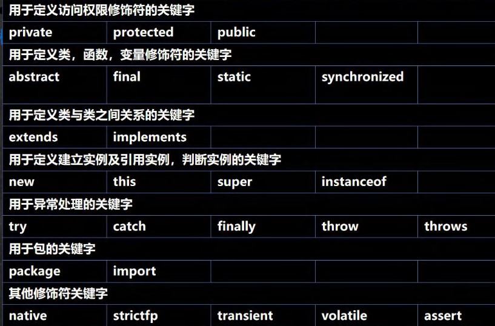

# Extra

***

# Java API文档
1. API (Application programming interface, 应用程序编程接口) 是Java提供的基本编程接口(Java提供的类还有相关的方法)
2. Java语言提供了大量的类, 因此母公司Oracle也为这些基础类提供了相应的API文档
3. Java类的组织形式


- Java8,11
  - 包1
    - 接口
    - 类(...)
      - 字段...
      - 构造器(构造方法)
      - 成员方法(方法)
    - 异常
  - 包2
  - 包3


# Java代码规范

 ```pdf
./extra/FormateOfJava.pdf
```

# 标识符的命名规则和规范
 - 标识符概念
  1. Java对各种变量, 方法和类等命名的时候使用的字符序列称为标识符
  2. 凡是自己可以起名字的地方都叫做标识符 int num1 = 90;

 - 标识符的命名规则
  1. 由英文字母大小写, 0~9, _或者$组成
  2. 不能用数字开头
  3. 不可以使用关键字和保留字, 但是可以包含关键字和保留字在其中
  4. Java中严格区分大小写, 命名的长度无限制
  5. 标识符中不能包含空格

***

 - **包名**: 多单词组成的时候所有字母都小写: `aaa.bbb.ccc`
 - **类名&接口名**: 多单词组成的时候, 所有单词的首字母大写: `Xxx.Yyy.Zzz`
 - **变量名&方法名**: 多单词组成的时候, 第一个单词的首字母小写, 第二个单词开每个单词的首字母大写: `xxx.Yyy.Zzz`
 - **常量名**: 所有字母都大写, 多单词的时候每个单词用下划线连接: `XXX_YYY_ZZZ`

#### 关键字
 - 定义: 被Java赋予特殊含义, 用于做特殊用途的字符串(单词)
 - 特点: 所有字母小写



#### 保留字
 - 介绍: 
   - 先版本Java未使用, 但是后续版本可能会使用的字:
   -` byValue、cast、future、 generic、 inner、 operator、 outer、 rest、 var 、 goto 、const`