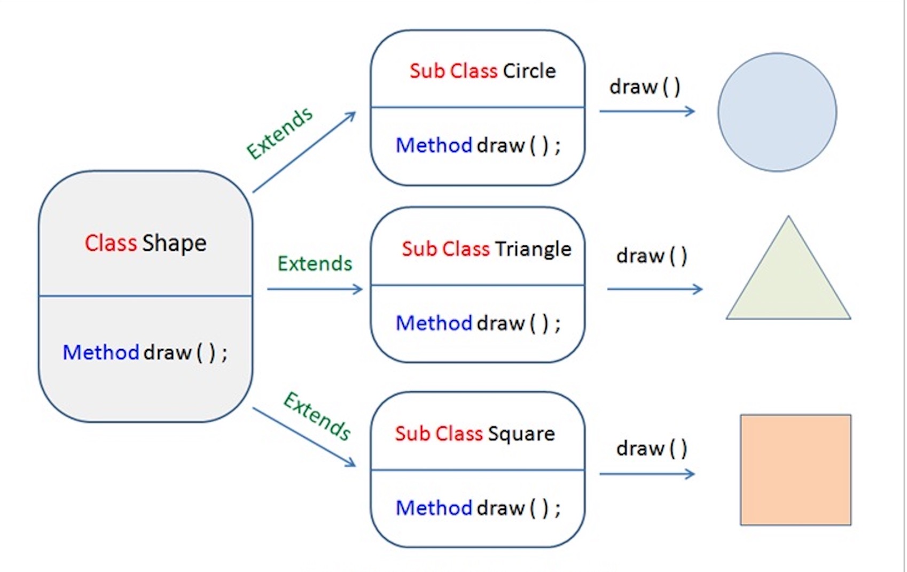
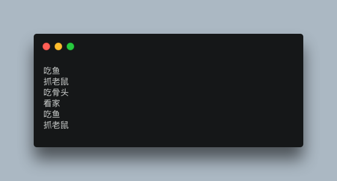

# 多态 

- 基本介绍
    - 方法或者对象具有多种形态，是面向对象的第三大特征，多态是建立在封装和继承的基础上的
    - 多态是同一个行为具有多个不同表现形式或形态的能力。
    - 多态性是对象多种表现形式的体现。

> 现实中，比如我们按下 F1 键这个动作：
>
> - 如果当前在 Flash 界面下弹出的就是 AS 3 的帮助文档；
> - 如果当前在 Word 下弹出的就是 Word 帮助；
> - 在 Windows 下弹出的就是 Windows 帮助和支持。
>
> 同一个事件发生在不同的对象上会产生不同的结果。

- 多态的优点
    1. 消除类型之间的耦合关系
    2. 可替换性
    3. 可扩充性
    4. 接口性
    5. 灵活性
    6. 简化性

- 存在的必要条件
    - 继承
    - 重写
    - 父类引用指向子类对象：`Parent p = new Child();`



```java
class Shape {
    void draw() {}
}
  
class Circle extends Shape {
    void draw() {
        System.out.println("Circle.draw()");
    }
}
  
class Square extends Shape {
    void draw() {
        System.out.println("Square.draw()");
    }
}
  
class Triangle extends Shape {
    void draw() {
        System.out.println("Triangle.draw()");
    }
}
```

> 也就是说， 可以在不同的class类里调用其他类的方法
>
> 在上述的例子中就是分别在circle，square，和triangle中分别使用了shape类中的draw方法


 - 这里举一个来自菜鸟的例子
```java
public class Test {
    public static void main(String[] args) {
      show(new Cat());  // 以 Cat 对象调用 show 方法
      show(new Dog());  // 以 Dog 对象调用 show 方法
                
      Animal a = new Cat();  // 向上转型  
      a.eat();               // 调用的是 Cat 的 eat
      Cat c = (Cat)a;        // 向下转型  
      c.work();        // 调用的是 Cat 的 work
  }  
            
    public static void show(Animal a)  {
      a.eat();  
        // 类型判断
        if (a instanceof Cat)  {  // 猫做的事情 
            Cat c = (Cat)a;  
            c.work();  
        } else if (a instanceof Dog) { // 狗做的事情 
            Dog c = (Dog)a;  
            c.work();  
        }  
    }  
}
 
abstract class Animal {  
    abstract void eat();  
}  
  
class Cat extends Animal {  
    public void eat() {  
        System.out.println("吃鱼");  
    }  
    public void work() {  
        System.out.println("抓老鼠");  
    }  
}  
  
class Dog extends Animal {  
    public void eat() {  
        System.out.println("吃骨头");  
    }  
    public void work() {  
        System.out.println("看家");  
    }  
}
```

输出结果为: 



