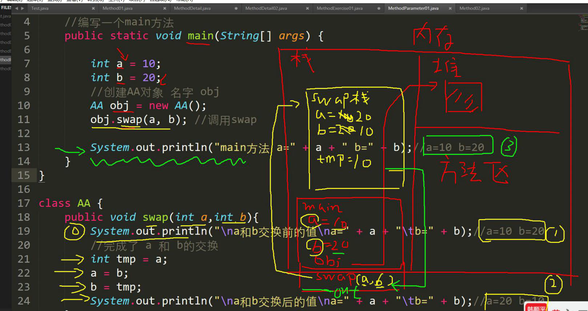

# 成员方法传参机制🌟

看案例, 分析结果: 

```java
public class MethodParameter1 {

    //编写一个main方法
    public static void main(String[] args) {

        int a = 10;
        int b = 20;
        //创建AA对象 名字 obj
        ww obj = new ww();
        obj.swap(a, b); //调用swap

        System.out.println("main方法 a=" + a + " b=" + b);//a=10 b=20
    }
}

class ww {
    public void swap(int a,int b){
        System.out.println("a和b交换前的值a=" + a + "b=" + b);//a=10 b=20
        //完成了 a 和 b的交换
        int tmp = a;
        a = b;
        b = tmp;
        System.out.println("a和b交换后的值a=" + a + "b=" + b);//a=20 b=10
    }
}
```

但是输出结果是: 


- **原因**



- 在内存中, 栈都是独立存在的, 也就是说, 尽管a和b在swap栈中发生了交换, 但是问题是在main方法中并没有发生交换,因此输出仍旧是a=10, b=20

- 基本数据类型, 传递的是*值*, 而形参的任何改变不影响实参


```java
public class MethodParameter02 { 
	//编写一个main方法
	public static void main(String[] args) {
		//测试
		B b = new B();
		int[] arr = {1, 2, 3};
		b.test100(arr);//调用方法
		System.out.println(" main的 arr数组 ");
		//遍历数组
		for(int i = 0; i < arr.length; i++) {
            System.out.print(arr[i] + "\t");
        }
		System.out.println();

	}
}
class B {
	//B类中编写一个方法test100，
	//可以接收一个数组，在方法中修改该数组，看看原来的数组是否变化
	public void test100(int[] arr) {
		arr[0] = 200;//修改元素
		//遍历数组
		System.out.println(" test100的 arr数组 ");
		for(int i = 0; i < arr.length; i++) {
			System.out.print(arr[i] + "\t");
		}
		System.out.println();
	}
}
```

输出为都是一样的, 被修改后的arr数组


-  **原因:** 
    - 数组都是同一个堆, 因此就算不在同一个地方改, 也是一样的, 具体原因是在前面的数组有具体的原因和内存分析
    - 尽管栈是相互独立的, 但是栈的内存指示, 也就是堆: 是完全相同的, 他们都直接指向堆, 而不在栈中直接运算
    - 因此, 相互独立的栈在修改后指向的数组也会变

#### 成员方法返回类型是引用类型

1. 编写一个方法, 可以打印二维数组

    ```java
    public class PrintTwoDimensionalArray {
        public static void main (String[]args){
            int [][] arr = {{0,0,1},{1,1,1},{1,1,3}};
            printArray printArray = new printArray();
            printArray.print2Array(arr);
        }
    }
    class printArray{
        public void print2Array(int [][]arr){
            for (int i = 0; i< arr.length; i++){
                for (int j = 0; j< arr.length; j++){
                    System.out.print(arr[i][j]);
                }
                System.out.println();
            }
        }
    }
    ```

2. 编写一个方法copyPerson，可以复制一个Person 对象，返回复制的对象。克隆对象， 注意要求得到新对象和原来对象是两个独立的对象，只是他们的属性相同

```java
public class MethodExercise02 {
    //编写一个main 方法
    public static void main(String[] args) {
        Person p = new Person();
        p.name = "milan";
        p.age = 100;
//创建tools
        MyTools tools = new MyTools();
        Person p2 = tools.copyPerson(p);
//到此p 和p2 是Person 对象，但是是两个独立的对象，属性相同
        System.out.println("p 的属性age=" + p.age + " 名字=" + p.name);
        System.out.println("p2 的属性age=" + p2.age + " 名字=" + p2.name);
//可以同对象比较看看是否为同一个对象
        System.out.println(p == p2);//false
    }
}
class Person {
    String name;
    int age;
}
class MyTools {
    //编写一个方法copyPerson，可以复制一个Person 对象，返回复制的对象。克隆对象，
//注意要求得到新对象和原来的对象是两个独立的对象，只是他们的属性相同
//
//编写方法的思路
//1. 方法的返回类型Person
//2. 方法的名字copyPerson
//3. 方法的形参(Person p)
//4. 方法体, 创建一个新对象，并复制属性，返回即可
    public Person copyPerson(Person p) {
//创建一个新的对象
        Person p2 = new Person();
        p2.name = p.name; //把原来对象的名字赋给p2.name
        p2.age = p.age; //把原来对象的年龄赋给p2.age
        return p2;
    }
}
```


***

### 方法递归(recursion)调用🌟

- ***基本介绍**:* 递归就是自己调用自己, 每次调用的时候传入不同的变量, 方便变成解决复杂问题, 同时可以让代码变得简洁

思考: 输出什么?

```java
public class Recursion1 {
    public static void main (String[]args){
        recursion1Test recursion1Test = new recursion1Test();
        recursion1Test.test(4);
    }
}

class recursion1Test{
    public void test(int n){
        if (n>2){
            test(n-1);
        }
        System.out.println("n="+n);
    }
}
```

输出: 

```
n=2
n=3
n=4

Process finished with exit code 0
```


***

- 阶乘

```java
public class Recursion1 {
    public static void main (String[]args){

        int res = recursion1Test.factorial(5);
        System.out.println(res+" a");
    }
}

class recursion1Test{
    public int factorial(int m){
        if (m==1){
            return m;
        } else {
            return factorial(m-1)*m;
        }

    }
}
```


***

#### 递归的重要规则‼️

1. 执行一个方法时, 就创建一个新的受保护的独立空间(栈空间)
2. 方法的局部变量是独立的, 不会互相影响, 比如n变量
3. 如果方法中使用的是引用类型变量(数组), 就会 共享该引用类型的数据
4. 递归必须向递归的条件逼近, 否则就是无限递归, 出现`StackOverflowError`
5. 当一个方法执行完毕, 或者遇到return, 就会返回, 遵循谁调用, 就把结果返回给谁, 同时当方法执行完毕或者返回的时候, 该方法也就执行完毕

***

#### 实战练习

1. 使用递归的方式求出斐波那契数列

```java
public class FibonacciSequence {
    public static void main (String[]args){
        T t = new T();
        System.out.println(t.Fib(7));
    }
}
class T {
    public int Fib(int i) {
        if (i > 0) {
            if (i == 1 || i == 2) {
                return 1;
            } else {
                return Fib(i-1) + Fib(i-2);
            }
        }
        else System.out.println("bigger than -1");
        return i;
    }
}
```

### 关于递归的个人理解

[具体的话可以去看这篇blog, 讲的很清晰](https://blog.csdn.net/qq_35427589/article/details/124448494)

刚刚遇到一个问题, 才发现自己上面没太理解递归的原理

- 这里是源码, 可以试着分析一下

```java
public class Demo01DiGui {
	public static void main(String[] args) {
		// a();
		b(1);
	}
	
	/*
	 * 3.构造方法,禁止递归
	 * 编译报错:构造方法是创建对象使用的,不能让对象一直创建下去
	 */
	public Demo01DiGui() {
		//Demo01DiGui();
	}


	/*
	 * 2.在递归中虽然有限定条件，但是递归次数不能太多。否则也会发生栈内存溢出。
	 * 4993
	 * 	Exception in thread "main" java.lang.StackOverflowError
	 */
	private static void b(int i) {
		System.out.println(i);
		//添加一个递归结束的条件,i==5000的时候结束
		if(i==5000){
			return;//结束方法
		}
		b(++i);
	}

	/*
	 * 1.递归一定要有条件限定，保证递归能够停止下来，否则会发生栈内存溢出。 Exception in thread "main"
	 * java.lang.StackOverflowError
	 */
	private static void a() {
		System.out.println("a方法");
		a();
	}
}
```

- 递归的公式: 

- ```java
    public void recur(int level , int param){
        // terminator
        if(level > MAX_LEVEL){
            return;
        }
        // process current logic
        process(level, param);
        // drill down
        recur(level:level+1 , newParam);
        // restore current status
    }
    ```

- 然后这里是递归的flow chart

- 

> in another word, whenever the fucntion met a thing that implies it self, then it need to go over it and re-calculate it again.

也就是所谓的弹栈

从5一路弹到最后... 弹到1

那么..先做一道leetcode题试试: 难度`中等`


- 这里的意思就是让你无限相加罢了. 那么也就是说... 递归出来一个无限相加的乘法, 把乘法归到最初始的状态, 具体该怎么做呢?很简单, 和我们上面看到的方法是一模一样的, 使用递归算法: 

- ```java
    class Solution {
        public int multiply(int A, int B) {
            int sum;
            if (B==0){
                return B;
            } else {
                return A+multiply(A, B-1);
            }
        }
    }
    ```

- 

泻药

***

2. 猴子吃桃子问题：有一堆桃子，猴子第一天吃了其中的一半，并再多吃了一个！以后每天猴子都吃其中的一半，然后再多吃一个。当到第10天时，想再吃时（即还没吃）发现只有1个桃子了。问题：最初共多少个桃子？

```java
public class RecursionExercise {
    public static void main (String[]args){
        int day = 10;
        Peach peach = new Peach();
        peach.peach(10);
        System.out.println(peach.peach(7));
    }


}
class Peach{
    public int peach(int day) {
        if(day == 10) {
            return 1;
        } else if ( day >= 1 && day <=9 ) {
            return (peach(day + 1) + 1) * 2);
        } else {
            System.out.println("day 在1-10");
            return -1;
        }
    }
}
```

- 这里重要的是思路分析的逆推, 以及对逻辑: `peach(day + 1) + 1) * 2`的观察

### 方法递归调用(实战应用)

1. 汉诺塔

```java
import java.util.Scanner;

public class hanoTower {
    public static void main(String[] args) {
        Scanner in = new Scanner(System.in);
        System.out.println("请输入圆盘的数量");
        int num = in.nextInt();
        hanoi(num, 'A', 'B', 'C');//起始柱、辅助柱、目标柱默认为A、B、C
    }

    //汉诺塔问题实现
    //a存放起始柱，b存放辅助柱、c存放目标柱
    public static void hanoi(int num, char a, char b, char c){
        if (num == 1) {
            System.out.println("第" + num + "个圆盘从" + a + " -> " + c);
        }else{
            hanoi(num - 1, a, c, b);//借助c把第 num 个以外的圆盘从a移动到b
            System.out.println("第" + num + "个圆盘从" + a + " -> " + c);//把第num个从a移动到c
            hanoi(num - 1, b, a, c);//借助a把第 num 个以外的圆盘从b移动到c
        }
    }

}

```


2. 八皇后

```java
public class eightqueen {
    public static int MAXQUEEN = 8;   //皇后个数，也是棋盘行列数
    public static int[][] Board = new int[MAXQUEEN][MAXQUEEN];    //初始化棋盘
    private static int count;

    public static void startTest(Todo Todo, int row){
        //第0列开始
        for (int col = 0; col < MAXQUEEN; col++) {
            //检查位置是否可以放棋子
            if (Todo.checkBoard(MAXQUEEN, row, col, Board) == 1){
                if (row == MAXQUEEN - 1){
                    count++;
                }
                //递归，向下一行前进
                if (row < MAXQUEEN - 1){
                    startTest(Todo, ++row);
                    //回退上一个栈
                    --row;
                }
            }
            //重新赋值为0，进行下一次判断
            Board[row][col] = 0;
        }
    }

    public static void main(String[] args) {
        int row = 0;
        Todo Todo1 = new Todo();
        startTest(Todo1, row);

        System.out.println("摆放一共有" + count + "种");
    }
}

class Todo {
    //定义横竖斜方向上是否有棋子
    public static boolean flag = true;
    //检查棋盘
    public int checkBoard(int MAXQUEEN, int row, int col, int[][] Board){
        //行方向上
        for (int i = 0; i < MAXQUEEN; i++) {
            if (Board[row][i] == 1){
                return 0;
            }
        }
        //列方向上
        for (int i = 0; i < MAXQUEEN; i++) {
            if (Board[i][col] == 1){
                return 0;
            }
        }
        //右下方向上
        for (int i = row, j = col; i < MAXQUEEN && j < MAXQUEEN; i++, j++) {
            if (Board[i][j] == 1){
                return 0;
            }
        }
        //左上方向上
        for (int i = row, j = col; i >= 0 && j >= 0; i--, j--) {
            if (Board[i][j] == 1){
                return 0;
            }
        }
        //左下方向上
        for (int i = row, j = col; i < MAXQUEEN && j >= 0; i++, j--) {
            if (Board[i][j] == 1){
                return 0;
            }
        }
        //右上方向上
        for (int i = row, j = col; i >= 0 && j < MAXQUEEN; i--, j++) {
            if (Board[i][j] == 1){
                return 0;
            }
        }
        if (flag) {
            //此点符合要求，可以下
            Board[row][col] = 1;
            //如果已经到最后一行，则打印棋盘
//            if (row == MAXQUEEN - 1){
//                printBoard(MAXQUEEN, Board);
//            }
            //可以放
            return 1;
        }
        return 0;
    }
    //打印棋盘
    public static void printBoard(int MAXQUEEN, int[][] Board){
        for (int i = 0; i < MAXQUEEN; i++) {
            for (int j = 0; j < MAXQUEEN; j++){
                System.out.print(Board[i][j] + " ");
            }
            System.out.println();
        }
        System.out.println("================");
    }
}


```

#### 依旧是递归:

[斐波那契数列另外一个方法的演示](https://leetcode.cn/problems/fei-bo-na-qi-shu-lie-lcof/solution/mian-shi-ti-10-i-fei-bo-na-qi-shu-lie-dong-tai-gui/)


递归的时间复杂度是随着n的增长而增长的`T(n)=o(f(n))` , 也是因为递归的这一个特性, 让我们leetcode中的[这一题](https://leetcode.cn/problems/fei-bo-na-qi-shu-lie-lcof/solution/)直接使用递归来进行取模会导致超时, 这时候就需要换一个思路, 将代码改进为 

```java
class Solution {
    public int fib(int n) {
        int a = 0, b = 1, sum;
        for(int i = 0; i < n; i++){
            sum = (a + b) % 1000000007;
            a = b;
            b = sum;
        }
        return a;
    }
}
```

- 具体分析
- 1. a = 0, b = 1; sum = (a+b)% 1000000007 = 1;
    2. a = b = 1;
    3. b = sum = 1;
- 一轮结束
    1. a = 1, b = 1; sum = (a+b)% 1000000007 = 2;
    2. a = b = 1;
    3. b = sum = 2;
- 二轮
- 1. a = 1, b = 2; sum = (a+b)% 1000000007 = 3;
    2. a = b = 2;
    3. b = 3;
- Round 3
- 1. a = 2, b = 3; sum = 5;
    2. a = b = 3;
    3. b = 5;
- ...

***
